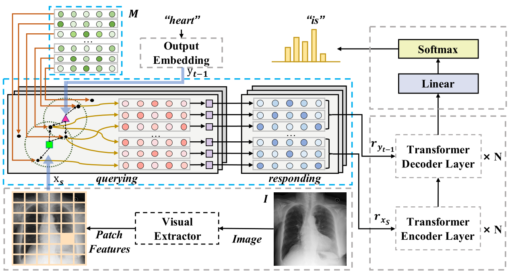

# 用于放射报告生成的跨模式记忆网络

Cross-modal Memory Networks for Radiology Report Generation

论文 2021 笔记2022.7.4

这篇是‘’通过memory-driven驱动Transformer生成放射报告‘’，作者的续作。、

## 问题

以前的研究主要遵循编码器-解码器范式，侧重于文本生成方面，很少有研究考虑跨模式映射的重要性，并明确利用此类映射来促进放射报告的生成。

通俗来讲，就是之前工作没有提高文本与图像的对应关系。有些通过co-attention来加强图像与文本但仍然受到跨模式表示难以对齐的限制因此期望中间介质来增强和平滑此类映射。

## 提出方法

提出了一种跨模式记忆网络（CMN）来增强用于放射报告生成的编码器框架，其中共享记忆用于记录图像和文本之间的对齐，以便于跨模式（即图像和文本）的交互和生成。

## 模型结构

### CMN

文中通过一个矩阵M（和上篇文章一样，老M了,）进行文本图像之间交互，M在训练中获得了文本图像的共享信息。CMN有两个输入，1个就是提取的视觉信息Xs，1个是解码器输出的y（训练中就是标签y1...y_t-1,测试中就是生成的）。两个输入与同一个参数矩阵Wq相乘获得各自的Query，M（m1...m_n）与参数矩阵Wk相乘得到K，计算QK相关性（其实就是在看M中信息与视觉和文本的相关性）D，相关性得到后归一化得到权重W，再用另一个参数矩阵得到V，WV计算得到CMN最终结构。你从计算可以看出这就是一个注意力的计算。就是视觉信息和文本信息在看M中自己所关注的东西。M是公共的，视觉和文本共同关注就是视觉与图像的联系。

可以这么理解，M首先被随机初始化视觉与文本是两个域，M信息随机在两个域的并集上，随着梯度回传，M渐渐的只出现在了交集上。所以M最后包含着公共信息，注意力的最后结果就是视觉与文本更关注的公共信息。

整个网络关键的地方就是CMN，其余的编码器-解码器结构就是transformer。

## 结果

网络进行了消融实验，然后对比了以前模型（包含上一篇R2Gen）。

