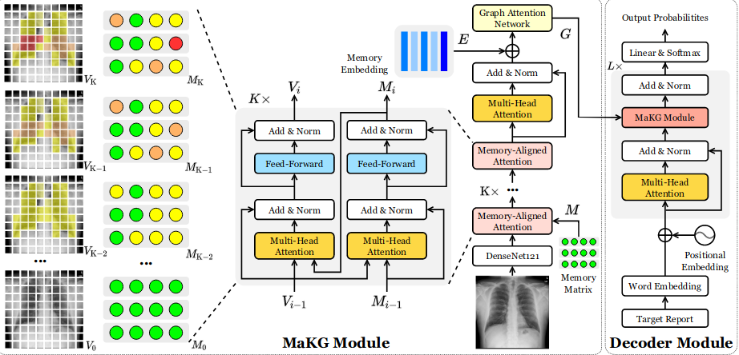

# 用于生成临床准确放射影像报告的内存对齐知识图

Memory-aligned Knowledge Graph for Clinically Accurate Radiology Image Report Generation

MICCAI2022

## 问题

数据驱动的神经模型难以识别图像中的多粒度异常区域和相应的异常。同一异常的不同状态可能有其特点，这些视觉模式的相关性被忽略了。此外，从异常区域识别实际异常也具有挑战性，因为复杂和罕见的异常在没有专业知识的情况下很难确定。

## 方法

引入了临床异常的记忆对齐知识图 (MaKG)，通过将其集成到用于报告生成的深度模型架构中，更好地学习异常的视觉模式及其关系。

## 模型

仿照以前工作，采用记忆槽 M ∈ RM×D 来记录异常区域的信息，这些信息将指示潜在的异常。我们还采用 E ∈ RN×D 嵌入来对每个异常的通用特征进行建模，采用图结构建模进行通用异常嵌入。

Memory-aligned Graph Embedding：结构上和之前的那篇工作一致。不过输入由标签变成了一个跨模态矩阵M进行聚合异常信息。输出是将所有的层输出的中间状态最后的M进行相加再经过自注意力层进行输出得到最后的存储矩阵。再结合E通过图注意力网络GAT进行异常提取。在这里图每个节点嵌入用于预测相应异常的存在概率，分类器使用加权二元交叉熵损失进行训练。

实验做的比较充足。