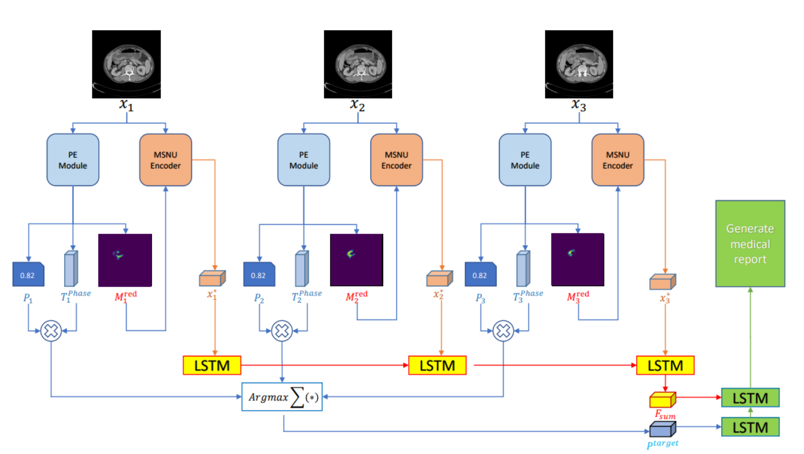

# 用于生成医学报告的聚合时空信息网络

Aggregated Spatiotemporal Information Network for Medical Report Generation

## 问题

胃 CT 图像与自然图像不同，具有显着特征。一方面，由于肿瘤体积小、特征弱，很难准确描述肿瘤在胃中的位置。另一方面，同一序列中的帧之间存在差异，因此在分析单幅图像时容易陷入局部最优解。

此外，医疗行业是一个高风险决策领域，但缺乏衡量决策不确定性的方法

## 方法

提出了聚合时空信息网络：

该网络由以下三个模块组成：（1）相对位置编码模块：设计以胃腔为中心，获取每个像素与胃腔之间的相对位置关系胃腔; (2)  LSTM 分析连续 CT 图像中肿瘤形态分布变化，并提出了一种基于掩码的非均匀编码机制来降低非肿瘤区域的权重因子，从而减少了非目标区域时间模型的特征变化； (3) 提出了专家模型检查模块，为相应的决策提供风险评估。

## 模型

阶段评估模块PE：用来衡量决策不确定性。使用分割网络提取胃腔生成掩模图像M green i ，对胃腔图像进行聚类得到质心，以此为坐标中心建立极坐标系。得到胃腔图像的坐标。再使用分割网络提取肿瘤 M red i 。对获得的胃腔分割掩码和肿瘤分割掩码的附加位置信息进行编码，用于提取特征f green i ，f red i 。然后利用LSTM模型分析两者之间的相关性，以输出相位类别标签Ti。然后FC层增加标签的维度，将增加的标签特征fTi和包含位置信息的胃腔掩码特征fgreen输入到专家验证模型中，输出特征fpredi经过模型分析相关性。最后，在上采样之后，输出给定标签下图中肿瘤的大致位置。