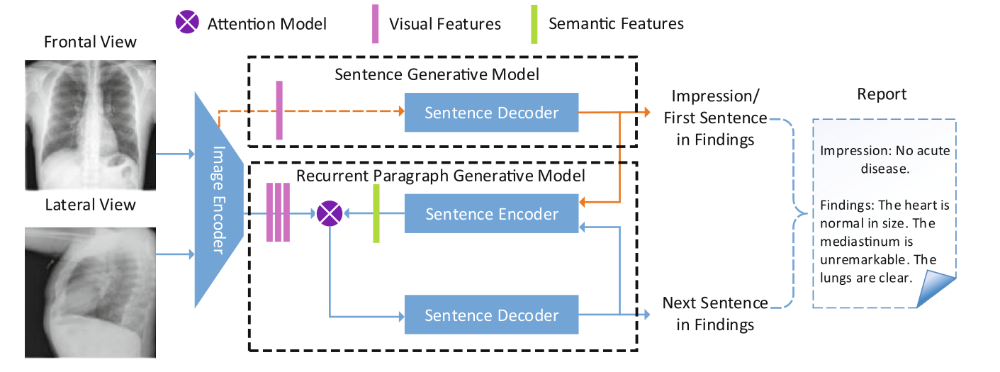
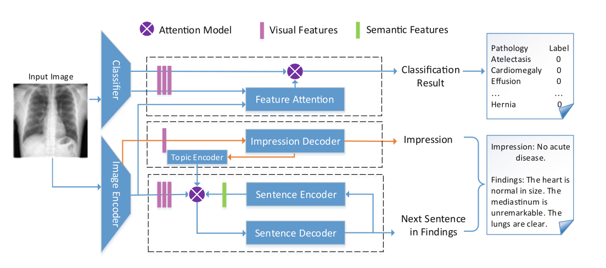

# 用于自动生成放射报告的带注意力的多模式递归模型

Multimodal Recurrent Model with Attention for Automated Radiology Report Generation

论文：2018 笔记：2022.7.1

## 问题

尽管深度学习技术的快速发展使得生成一个结论性句子成为可能，但由于医学图像的复杂性，现有方法产生的结果不够可靠。为医学图像生成详细的段落描述仍然是一个具有挑战性的问题。

问题1：前人有些好的模型是针对短句子，而这里是长句子

问题2：前人针对这个的模型结果有些重复语句，因为没有考虑到上下文的连贯性。

## 提出方法

模型以递归方式将卷积神经网络（CNN）与长短时记忆（LSTM）相结合。它不仅能够产生高水平的结论性印象，而且能够逐句产生详细的描述性发现来支持结论。

1. 我们提出了一种新的循环生成模型，以逐句生成结果，其中后续句子以多模式输入为条件，包括其前一句和原始图像，

2. 我们为我们提出的多模式模型采用注意机制来提高性能。

## 模型结构

整体架构将来自多个视图的医学图像作为输入，并生成带有印象和发现的放射报告。

首先使用编码器-解码器模型，该模型将图像对作为输入并生成第一个句子。然后将第一个句子输入句子编码网络，输出该句子的语义表示。然后，将图像的视觉特征和前一个句子的语义特征结合起来，作为生成下一个句子的多模式循环生成网络的输入。重复此过程，直到模型生成段落中的最后一句。

image encoder是采用resnet152，首先输入senten decoder（第一层）生成impression作为第一句话，这句话起着总领全文的作用，这句话会进入一个的encoder生成句子特征与cnn特征通过注意力机制结合后送入下一个decoder生成句子。每一个生成的句子会与第一句话结合共同输入encoder中。

## 结果

除了常见的图像字幕指标，文章指出医学报告有着独特性，提出了新的评价指标。文中从原始数据集的MTI注释和一些手动注释构建了一个关键词词典。计算关键字准确性（KA）度量，即模型正确生成的关键字数与真实标签所有关键字数的比率。最终验证了模型的准确性。

## 承接上文

上这篇论文在iu-X-ray数据集上证明了有效性。但没有大数据集验证。这个论文工作是将上面的网络应用到大数据集网络。将学习到的视觉特征转移到在大型胸部X射线数据集上训练的分类网络，并使用一种新的注意力引导特征融合策略来提高14种常见胸部疾病的检测性能。

其实上面是一种小到大的迁移学习。

报告生成部分与上文分析一样。

首先将分类网络在大数据上正常训练，报告生成网络在iu上训练。

固定两个网络的特征提取层，然后通过注意力机制融合。证明分类效果？

## 问题

有没有一种可能性模型提升与报告生成无关。仅仅因为训练了2个不同的分类网络？
