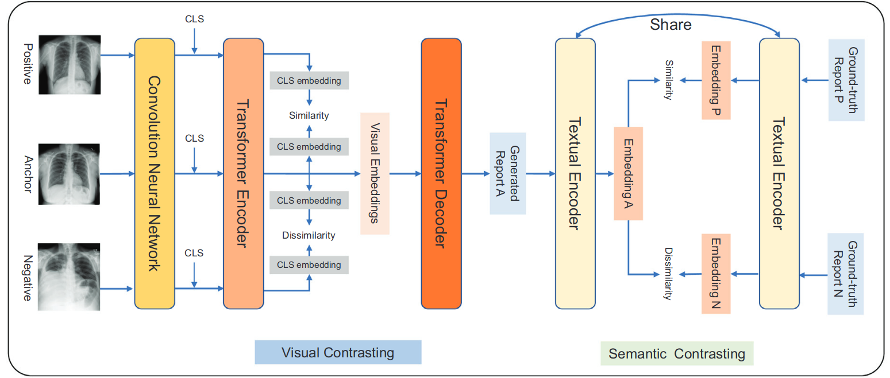

# 用于自动胸部 X 射线报告的对比三联网络

A contrastive triplet network for automatic chest X-ray reporting

## 问题

严重偏差的数据分布（例如，正常情况通常比异常情况在整个数据集中占主导地位）给数据驱动的神经模型生成满意的异常描述带来了巨大挑战。

## 方法

提出了一种基于 Transformer 架构的对比三元组网络（CTN），用于自动胸部 X 射线报告，以缓解数据偏差问题。我们的 CTN 通过使用三元组网络比较正常和异常病例之间的视觉和语义信息，有效地增强异常。

## 模型

我们构建了具有正例、锚例和负例（包括正常和异常情况）的不同类型的三元组。（两异常一正常或两正常一异常）。由于一些异常病例在临床实践中是有限的，我们还对数据进行数据增强以进行训练。我们从两个方面对数据进行扩充：1）对有异常的视觉胸部X光图像进行扩充； 2）将增加带有异常描述的报告。视觉增强包含裁剪和水平翻转。语义报告增强包括描述正常发现的句子的随机删除和同义词的替换。

然后，将从两个方面获取三元组之间的对比信息：1）将Transformer编码器编码的胸部X射线图像的视觉嵌入进行比较； 2) 将比较由预先训练的文本编码器编码的生成报告的语义嵌入。

为了实现三元组之间的语义对比，生成的锚实例报告和正负实例的真实报告被编码为语义嵌入。我们在此引入了一个预训练的文本编码器（即临床 BERT [47] 与附加的 MLP 网络相结合）用于语义嵌入。文字编码器的训练如图所示

对比学习：

ep,ea,en 是正例、锚例和负例的视觉嵌入

sp 和 sn 是真实的正面和负面报告的语义嵌入

