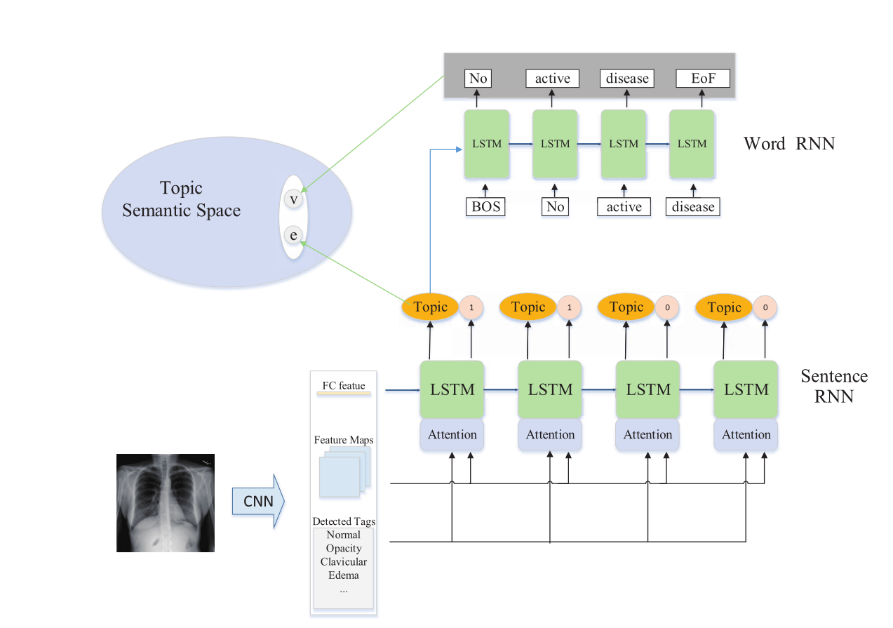
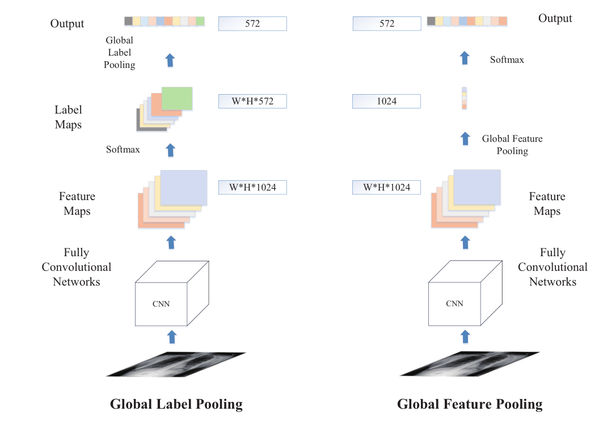
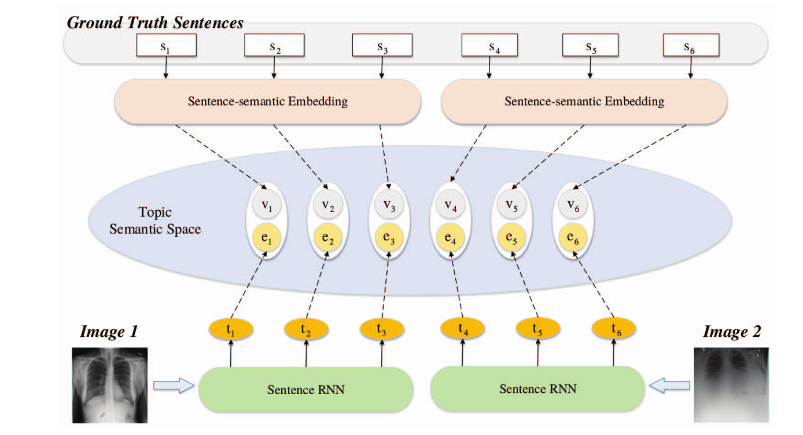

# 用层次递归神经网络自动生成医学影像诊断报告

Automatic Generation of Medical Imaging Diagnostic Report with Hierarchical Recurrent Neural Network

论文：2019 笔记：2022.7.1

## 问题

问题1：难以同时准确检测所有异常，尤其是罕见疾病

问题2：医学图像报告由许多段落和句子组成，这些段落和句子比自然图像标题长。

问题3：之前采用分层LSTM的模型通常会生成一些相似但无用的句子，主要原因是sentence  LSTM生成相似的主题向量。

## 提出方法

提出了一个新的框架来准确检测异常并自动生成医疗报告。报告生成模型基于层次递归神经网络（HRNN）。我们将主题匹配机制引入到HRNN中，以使生成的报告更加准确和多样。在HRNN模型中引入了软注意机制。（个人认为HRNN就是sentence LSTM与word LSTM分层而已）

1. 在多标签分类CNN中使用全局标签池来代替全局特征池，这提高了CNN的准确性和鲁棒性。
2. 将主题注意机制引入sentence LSTM
3. 提出了主题匹配机制，提高了主题向量的多样性和准确性。

## 模型结构

### 全局标签池异常检测

模型经过cnn后的其中一个任务是多标签分类提取tags。在多标签loss计算时根据类别数量比例不同，基于不同类别权重计算loss来改善类别不均衡的情况。

在多标签分类任务时，采用DenseNet网络，它在最后一个完全连接层之前使用全局池操作。该操作不适用于异常检测任务。当患者同时与多个异常相关时，全局合并操作可能会因以下两个原因对特征提取造成损害：（i）异常检测通常依赖于局部图像的特征，而不是全局特征；（ii）由于不同疾病的特征可能分布在不同的区域，因此全球池操作可能会混合多种疾病的特征，并丢失一些空间信息。因此，我们使用全局标签池操作（GLP）调整DenseNet模型。

通常分类网络最后会有一个全局池化层，将whc的特征变成1×1×c然后经过FC与softmax。这里与普通DenseNet不同的只有最后的部分，获得1024维度的最后特征图后，不同于之前采用全局池化层，这里使用1×1×c的卷积处理得到与最后标签维度相同的W×H×c形状的label maps。按照文中所说避免了多种疾病特征混合和空间信息的丢失。最后使用全局最大池化得到output。

## 主题词匹配

解码器是常见的sentence LSTM与word LSTM结构，这里sentence LSTM的参数优化是通过最终word LSTM的结果loss反传实现的。相对于直接用损失训练的词word LSTM参数，训练sentence LSTM效率很低。sentence LSTM可能没有经过充分训练，作者认为这也是在最终结果中出现很多重复句子的原因。

主题匹配机制将主题向量和句子映射到同一语义空间。由于一个主题向量与一个句子配对，该句子叙述了医学图像的相应信息，因此我们假设它们具有相同的语义。主题向量和句子都被送入两个不同的映射网络，以学习语义空间。主题映射网络由两个完全连接层和ReLU层组成。句子映射网络将每个单词嵌入到一个向量中。将主题向量及其对应句子联合嵌入公共空间后，将主题向量映射到嵌入向量e，并将其对应句子映射到另一个嵌入向量v。计算语义空间中e和v之间的余弦相似性。通过最小化对比损失来训练模型。

