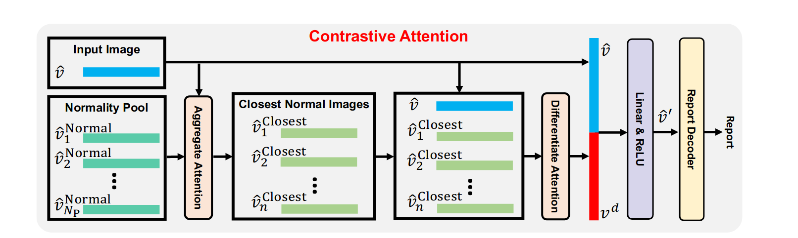

## 综述总结

1.On the Automatic Generation of Medical Imaging Reports 2018年

第一个生成由医生撰写的真正自然报告的工作，这些报告通常很长并且涵盖不同的主题。

提出了一种具有共同注意力的多任务分层模型，用于自动预测关键字并生成长段落。给定一个被划分为多个区域的图像，我们使用 CNN 来学习这些补丁的视觉特征。然后，这些视觉特征被输入到多标签分类（MLC）网络中以预测相关标签。在标签词汇表中，每个标签都由一个词嵌入向量表示。给定特定图像的预测标签，它们的词嵌入向量充当该图像的语义特征。然后，将视觉特征和语义特征输入到共同注意模型中，以生成上下文向量，同时捕获该图像的视觉和语义信息。至此，编码过程就完成了。接下来，从上下文向量开始，解码过程生成文本描述。

数据集：IU-Xray PEIR Gross

编码器：CNN （VGG-19）

解码器：共同注意力 + 分层LSTM

额外组建：Tags预测补充

训练方法：CE

评价指标：NLG 

2.Hybrid Retrieval-Generation Reinforced Agent for Medical Image Report Generation 2018年

提出了一种新颖的混合检索生成强化代理（HRGR-Agent），它将填充人类先验知识的基于传统检索的方法与基于现代学习的方法相结合，以实现结构化、稳健和多样化的报告生成。 HRGR-Agent 采用分层决策程序。对于每个句子，高级检索策略模块选择从现成的模板数据库检索模板句子，或调用低级生成模块来生成新句子。 HRGR-Agent 通过强化学习进行更新，以句子级和单词级奖励为指导。实验表明，我们的方法在两个医疗报告数据集上取得了最先进的结果，生成了平衡良好的结构化句子，并对异构医疗报告内容进行了稳健的覆盖。此外，我们的模型实现了医学异常术语的最高检测精度，并提高了人类评估性能。

首先，它预测概率分布 生成新句子并检索候选模板句子。根据第一步的预测，它会触发不同的操作。如果自动生成获得最高概率，则激活生成模块以生成以当前主题状态为条件的单词序列（图2右侧第二行）。如果T中的某个模板获得最高概率，则从现成的模板库中检索该模板，并将其作为当前句子主题的生成结果。

第一个将强化学习引入报告生成任务中

数据集：IU-Xray CX-CHR

编码器：CNN 

解码器：句子lstm+检索增强+单词lstm

训练方法：强化学习 CIDER奖励

评价指标：NLG 

3.Multimodal Recurrent Model with Attention for Automated Radiology Report Generation 2018年

模型以递归方式将卷积神经网络（CNN）与长短时记忆（LSTM）相结合。它不仅能够产生高水平的结论性印象，而且能够逐句产生详细的描述性发现来支持结论。我们提出了一种新的循环生成模型，以逐句生成结果，其中后续句子以多模式输入为条件，包括其前一句和原始图像，我们为我们提出的多模式模型采用注意机制来提高性能。

该模型将图像对作为输入并生成第一个句子。然后将第一个句子输入句子编码网络，输出该句子的语义表示。然后，将图像的视觉特征和前一个句子的语义特征结合起来，作为生成下一个句子的多模式循环生成网络的输入。重复此过程，直到模型生成段落中的最后一句。

提出了新的评价指标。文中从原始数据集的MTI注释和一些手动注释构建了一个关键词词典。计算关键字准确性（KA）度量，即模型正确生成的关键字数与真实标签所有关键字数的比率。

数据集：IU-Xray 

编码器：CNN resnet-152

解码器：句子编码加句子解码 循环结构 lstm

额外组建：循环结构 

训练方法：CE

评价指标：NLG + CE +KA

4.CheXpert: A Large Chest Radiograph Dataset with Uncertainty Labels and Expert Comparison 2019年

提出来标签机

5.Show, Describe and Conclude: On Exploiting the Structure Information of Chest X-Ray Reports 2019年

印象”部分是对“发现”部分的诊断总结；正常的外观比异常的外观在每个部分中都占主导地位。现有的研究很少探索和考虑这一基本结构信息。在这项工作中，我们提出了一种新颖的框架，该框架利用报告部分之间和内部的结构信息来生成 CXR 成像报告。首先，我们提出了一个两阶段策略，明确结果和印象之间的关系。其次，我们设计了一种新颖的协作多智能体系统，该系统隐式捕获异常与正态之间的不平衡分布。

据我们所知，我们的工作是调查 CXR 报告结构的首次努力。

数据集：IU-Xray  CX-CHR

编码器：

解码器：

额外组建：循环结构 

训练方法：CE + 强化学习 BLUE4奖励

6.Knowledge-Driven Encode, Retrieve, Paraphrase for Medical Image Report Generation2019年

们提出了一种新颖的知识驱动编码、检索、释义 (KERP) 方法，该方法将传统的基于知识和检索的方法与基于现代学习的方法相协调，以生成准确、稳健的医疗报告。具体来说，KERP 将医疗报告生成分解为显式医疗异常图学习和后续自然语言建模。 KERP首先采用编码模块，通过结合先前的医学知识将视觉特征转换为结构化异常图；然后是检索模块，根据检测到的异常检索文本模板；最后，一个释义模块，根据具体情况重写模板。 KERP的核心是提出的通用实现单元——图变换器（GTR），它可以在知识图、图像和序列等多个领域的图结构数据之间动态地转换高级语义。

数据集：IU-Xray  CX-CHR

编码器：CNN+Graph Transformer

解码器：检索+Graph Transformer

额外组建：Graph Transformer将视觉特征转换为图特征 检索模板 改写模板生成报告； 辅助分支进行异常分类

训练方法：CE + 先使用真实模板训练释义，然后使用检索模块生成的采样模板进行训练。（模板截断了梯度）

7.Clinically Accurate Chest X-Ray Report Generation 2019年

我们提出了一种领域感知的自动胸部 X 射线放射学报告生成系统，该系统首先预测报告中将讨论哪些主题，然后有条件地生成与这些主题相对应的句子。由此产生的系统使用强化学习进行微调，同时考虑可读性和临床准确性，并通过拟议的临床一致性奖励进行评估。

数据集：IU-Xray  MIMIC-CXR

编码器：CNN 

解码器：分层解码器

额外组建：

训练方法：CE + CIDER奖励 + CheXpert Clinically Accurate奖励

评价指标：NLG + CE +hit

8.Automatic Generation of Medical Imaging Diagnostic Report with Hierarchical Recurrent Neural Network 2019年

报告生成模型基于层次递归神经网络（HRNN）。我们将主题匹配机制引入到HRNN中，以使生成的报告更加准确和多样。在HRNN模型中引入了软注意机制。

难以同时准确检测所有异常，尤其是罕见疾病。医学图像报告由许多段落和句子组成，这些段落和句子比自然图像标题长。sentence  LSTM生成相似的主题向量。

DenseNet网络最后一个完全连接层之前使用全局池操作。不适用于异常检测任务。当患者同时与多个异常相关时，全局合并操作可能会因以下两个原因对特征提取造成损害：（i）异常检测通常依赖于局部图像的特征，而不是全局特征；（ii）由于不同疾病的特征可能分布在不同的区域，因此全球池操作可能会混合多种疾病的特征，并丢失一些空间信息。因此，我们使用全局标签池操作（GLP）调整DenseNet模型。

数据集：IU-Xray  

编码器：CNN DenseNet

解码器：分层解码器

额外组建：异常分类 + 主题词匹配

训练方法：CE 

评价指标：NLG

9.Automatic Radiology Report Generation based on Multi-view Image Fusion and Medical Concept Enrichment 2019年

大量的胸部x射线图像对编码器进行预训练，通过加强交叉视图一致性来利用多视图图像。

将一名患者的正面和侧面图像视为一个输入对输入编码，编码器使用Resnet-152作为主干，提取视觉特征。

Chest Radiographic Observations 是指通过大型类似数据集进行多标签分类的预训练。Visual Features作为实际训练过程中提取的视觉信息，Medical Concepts 是通过单独的网络层提取的Tag信息。

多视图融合，文章中使用了两种不同视图进行信息提取，得到的不同特征图。我的理解是这里并没有将两种图化为不同通道进行合并，而是分别输入特征提取网络得到不同的特征图。为了保证特征一致性，文中采用了一种MSE损失来优化网络得到同样含义的特征图（同一个人特征应当具有统一性。）

数据集：IU-Xray  CheXpert

编码器：CNN Resnet-152

解码器：分层lstm解码器

额外组建：异常分类 提取tag，预训练

训练方法：CE 

评价指标：NLG  ROC-AUC

10.Learning to Generate Clinically Coherent Chest X-Ray Reports 2020年

典型的抽象方法往往会产生流畅但临床上不正确的放射学报告。通常用于评估图像字幕系统的语言生成指标无法直接评估生成报告的描述准确性，而准确性在医学领域十分关键。

第一个阶段就是普通的生成报告

第二个阶段是微调，在生成报告的基础上，经过chexpert网络提取分类判断一致性，对模型进行微调。

数据集：MIMIC-CXR

编码器：CNN DenseNet-121 +transformer

解码器：transformer 

额外组建：

训练方法：CE + chexper 可微分类

评价指标：NLG  CE

11.Learning Visual-Semantic Embeddings for Reporting Abnormal Findings on Chest X-rays 2020年

模型受到数据偏差（例如标签不平衡）的影响，并面临文本生成模型固有的常见问题（例如重复）。在这项工作中，我们重点报告放射图像的异常发现；我们提出了一种方法来识别报告中的异常结果，并使用无监督聚类和最小规则对它们进行分组，而不是对完整的放射学报告进行训练。我们将该任务表述为跨模式检索，并提出条件视觉语义嵌入来在联合嵌入空间中对齐图像和细粒度异常发现。

数据集：

编码器：

解码器：

额外组建：

训练方法：无监督聚类和最小规则对它们进行分组CE 

评价指标：NLG  CE

12.Chest X-ray Report Generation through Fine-Grained Label Learning 2020年

从图像中学习对结果的细粒度描述，并使用其出现模式从大型报告数据库中检索和定制类似的报告。我们还开发了一种自动标记算法，用于将此类描述符分配给图像，并构建一个新颖的深度学习网络，该网络可以识别结果的粗粒度和细粒度描述。

通过特征金字塔网络组合来自不同模型的 ImageNet 预训练特征。这就形成了多模型特征金字塔，它结合了多个尺度的特征。 VGGNet（16 层）和 ResNet（50 层） 用作特征提取器。出了扩张块来从提取的 ImageNet 特征中学习高级特征。每个扩张块由多尺度特征的扩张卷积、用于提高收敛性的恒等映射的跳跃连接[9]以及用于减少过度拟合的空间丢失组成。两个学习器一个负责核心标签，一个负责详细标签

数据集：MIMIC-NIH

编码器：vgg与resnet组合及扩张块

解码器：检索组合的方式，相当于模板了。

额外组建：

训练方法：无监督聚类和最小规则对它们进行分组CE 

13.When Radiology Report Generation Meets Knowledge Graph 2020年

## 

与自然图像字幕中每一个词的同等重要性相比，积极的疾病关键词提及的准确性在放射学图像报告中至关重要；报告质量的评估应更注重疾病关键词及其相关属性的匹配，而不是计算N-gram的出现次数。

利用预先构建的图嵌入模块（用图卷积神经网络建模），对多种疾病的发现进行辅助生成报告。知识图谱的纳入允许对每个疾病发现和它们之间的关系建模进行专门的特征学习。

提出MQIR指标

数据集：IU-RR

编码器：CheXpert上预训练的DenseNet-121

解码器：多层lstm

额外组建：图神经网络 多标签分类器

训练方法：CE 

评价指标：NLG MQIR AUC

14.Generating Radiology Reports via Memory-driven Transformer 2020年

我们提出一种memory-driven驱动Transformer模型生成放射报告。提出一种关系记忆来记住前一代生成的过程，MCLN将记忆关系合并到Transformer解码器的层中

在整个训练集上存在相似的图像，即病症一样，他们在信息上有共通性，所以利用记忆组件来记忆这种共通性。

数据集：IU-Xray  MIMIC-CXR

编码器：CNN resnet152+Transformer 3

解码器：记忆驱动 Transformer 3，其实创建m

额外组建：记忆矩阵

训练方法：CE 

评价指标：NLG CE

15.Hierarchical X-Ray Report Generation via Pathology tags and Multi Head Attention 2020年

医学图像字幕需要高精度探测异常和提取信息和连贯性。即报告必须易于阅读和传达医学事实准确。我给定一组病人的胸部x光图像,提出网络预测医学标记和报告生成一个可读的放射学。生成报告和标签,提出了网络学习来提取图像的特征从一个深CNN和生成标签为每个病人的x射线图像嵌入的。我们使用变压器学习自我和交叉的注意。我们与self-attention编码图像和标记功能得到更好的表示。同时使用上述功能交叉的关注与输入序列生成报告的结果。然后,生成之间的交叉应用的关注结果和输入序列生成报告的印象。

1.采用分治方法。首先，从正常患者中识别出异常患者，并生成其MTI标签嵌入。然后根据标签进行条件学习。2.为了预测报告使用一种包含两个编码器和两个解码器的Transformer。3.标签嵌入和图像特征分别使用两个编码器编码。报告的findings和impressions通过两个堆叠的解码器学习，帮助前者改进后的生成。

数据集：IU-Xray  

编码器：先SSD提取区域，提出一个简单的深度可分离卷积提取获得图像特征；

异常选择网络判断正异常产生tags

解码器：Transformer 

额外组建：

训练方法：CE 

评价指标：NLG 

15.Automated radiology report generation using conditioned transformers 2021年

（1）微调预训练的 Chexnet 以预测图像中的特定标签。 (2) 根据预测标签的预训练嵌入计算加权语义特征。 (3) 根据视觉和语义特征调整预训练的 GPT2 模型，以生成完整的医疗报告。我们使用单词重叠指标分析生成的报告，同时添加新的有意义的基于语义的相似性指标。所提出的模型（我们称之为 CDGPT2）在定量指标方面超越了大多数非分层循环模型和基于 Transformer 的模型，同时训练速度也相当快。此外，该模型不需要特定的词汇表，并且可以在不改变架构的情况下在不同的数据集上进行训练。

数据集：IU-Xray  CheXpert

编码器：CNN Densenet121

解码器：预训练的 distilGPT2 

额外组建：

训练方法：CE 

评价指标：NLG  similarity metrics.

16.Cross-modal Memory Networks for Radiology Report Generation2021年

提出了一种跨模式记忆网络（CMN）来增强用于放射报告生成的编码器框架，其中共享记忆用于记录图像和文本之间的对齐，以便于跨模式（即图像和文本）的交互和生成。

数据集：IU-Xray  MIMIC-CXR

编码器：CNN ResNet101+Transformer 3

解码器：Transformer 3

额外组建：跨模态记忆矩阵

训练方法：CE 

评价指标：NLG CE

17.RATCHET: Medical Transformer for Chest X-ray Diagnosis and Reporting 2021年

数据集：IU-Xray  MIMIC-CXR

编码器：CNN Densenet121

解码器：Transformer 

额外组建：

训练方法：CE 

评价指标：NLG CE

18.Radiology Report Generation for Rare Diseases via Few-shot Transformer 2021年

图像中疾病区域的比例较低，使得视觉信息变得多余或与要编码的罕见疾病无关。第二点在于，由于多模态表示，在编码阶段建模的相关性可能无法在解码阶段有效地解码。为了解决，提出了针对罕见疾病的小样本 Transformer 模型，即 TransGen。它组装了两个关键模块。编码阶段，引入语义感知视觉学习（SVL）模块来捕获罕见疾病的区域。解码阶段，提出了记忆增强语义增强（MASE）模块来增强中间表示。利用历史生成句子中包含的语义信息，有利于涉及罕见疾病的报告生成。

数据集：IU-Xray  MIMIC-CXR

编码器：CNN + SVL ResNet101 + Transformer

解码器：MASE+Transformer 

额外组建：SVL；记忆增强语义增强，从历史中挖掘语义信息融合到解码

训练方法：CE 

评价指标：NLG KA CE

19.Competence-based Multimodal Curriculum Learning for Medical Report Generation 2021年

1）严重的数据偏差和2）有限的医学数据。为了减轻数据偏差并充分利用可用数据，我们提出了基于能力的多模式课程学习框架（CMCL）。具体来说，CMCL模拟放射科医生的学习过程，逐步优化模型。

使用课程学习的方式构建不同组，逐步学习。CMCL 以选择性的方式构建训练批次。 CMCL首先根据难度指标对所有训练实例进行排序，然后逐渐扩大该批次选择的训练实例的范围。通过这种方式，CMCL 可以从简单到困难的实例训练模型。

定义了学习难易程度的指标：4个

数据集：IU-Xray  MIMIC-CXR

编码器：X

解码器：X

额外组建：X

训练方法：课程学习 + CE 

评价指标：NLG 

20.Exploring and Distilling Posterior and Prior Knowledge for Radiology Report Generation 2021年

1. 数据集中正常图像是多数，而异常是少数，其次，正常图像的外观大大优于异常图像，会分散模型的注意力，使其无法准确捕捉罕见且多样的异常区域特征。
2. 在报告中，放射科医生倾向于描述图像中的所有项目，使正常区域的描述占据整个报告的主导地位。此外，许多相似的句子被用来描述相同的正常区域。由于这种不平衡的文本分布，使用此类数据集进行训练使正常句子的生成占主导地位使模型无法描述特定的关键异常。广泛使用的HRNN生成了一些正常的重复句子，并且无法描述一些罕见但重要的异常。

数据集：IU-Xray  MIMIC-CXR

编码器：resnet152 +Transformer

解码器：Transformer

额外组建：先验与后验知识

训练方法：CE 

评价指标：NLG  AUC

21.Contrastive Attention for Automatic Chest X-ray Report Generation 2021年

为了有效地捕获和描述异常区域，我们提出了对比注意 (CA) 模型。 CA 模型不是只关注当前输入图像，而是将当前输入图像与正常图像进行比较以提取对比信息。获得的对比信息可以更好地表示异常区域的视觉特征。

先从数据集中提取P个正常图像，与输入图像进行Aggregate Attention，Aggregate Attention作用是排除一些噪声图像与一些视角有明显差异对图像，以防对Contrastive Attention造成负面影响。Aggregate Attention其实就是一个transformer中对点积注意力。注意这里V上全局视觉信息，所以进行完一次注意力只有1个V_closest,所以这里使用n个Aggregate Attention来生成n个V_closes。

Differentiate Attention来提取公共特征，具体做法上将V与得到的n个V_closes连接后进行自注意力计算，得到结果再全局平均池化，得到共同信息V_c。再用V-V_c得到差异信息V_d。

对比

数据集：IU-Xray  MIMIC-CXR

编码器：ResNet-50

解码器：Transformer

额外组建：先验与后验知识

训练方法：CE 

评价指标：NLG  CE 人工评价

22.Auto-Encoding Knowledge Graph for Unsupervised Medical Report Generation 2021年

提出一个无监督模式知识图Auto-Encoder (KGAE)接受独立的图像和报告培训。KGAE包含一个预先构建知识图,knowledgedriven编码器和知识解码器。图的知识是共享潜在空间的视觉和文本域;知识编码器项目医学图像和报告潜在的空间中相应的坐标和知识解码器生成一份医学报告给这个空间的坐标。由于知识编码器和译码器可以被训练独立的图像和报告,KGAE无监督。实验表明,无监督KGAE生成理想的医学报告不使用任何image-report训练对。

无监督

数据集：IU-Xray  MIMIC-CXR

编码器：图像ResNet-50 报告 Transformer +图神经网络

解码器：Transformer +图神经网络

额外组建：无监督指的是将图像和报告编码不成对看待。训练只通过报告编码生成报告训练解码器。还额外进行疾病分类训练减小图像与报告的差距来训练编码器。

训练方法：CE 

评价指标：NLG  CE 人工评价

23.Progressive Transformer-Based Generation of Radiology Reports

提出了一个连续（即图像到文本到文本）生成框架，其中我们将放射报告生成问题分为两个步骤。与立即从图像生成完整的放射学报告相反，该模型在第一步从图像生成全局概念，然后使用transformer架构将其转换为更精细和连贯的文本。

数据集：IU-Xray  MIMIC-CXR

编码器：Densenet

解码器：MeshedMemory Transformer

第二阶段：BART

额外组建：为训练数据集中的每个报告提取高级上下文C，为此，我们采用了MIRQI工具。然后，我们为每个阶段构建独立的训练数据，即ViLM和LM的微调。

训练方法：CE 

评价指标：NLG  CE 

24.Variational Topic Inference for Chest X-Ray Report Generation 2021年

提出了用于自动生成报告的变分主题推理。具体来说，我们引入了一组主题作为潜在变量，通过在潜在空间中对齐图像和语言模式来指导句子生成。主题在条件变分推理框架中推断，每个主题都控制报告中句子的生成。

数据集：IU-Xray  MIMIC-CXR

编码器：图像Densenet + Transformer   报告Transformer

解码器：LSTM

额外组建：通过VAE拉近两个编码的距离产生报告。 +视觉注意力

训练方法：CE 

评价指标：NLG  CE 人工评价

25.Automated Generation of Accurate & Fluent Medical X-ray Reports

全可微和端到端范式实现生成的医疗报告流畅，临床准确。该范式包含三个互补模块：以患者的胸部X光图像和临床病史文档为输入，我们的分类模块生成了疾病相关主题的内部检查表，称为丰富的疾病嵌入；然后将嵌入表示传递给基于transformer的生成器，以生成医疗报告；同时，我们的生成器还创建了加权嵌入表示，并将其提供给我们的解释器，以确保与疾病相关主题的一致性。

解释器模块是一个完全可微的网络模块，根据生成器的输出来估计疾病相关主题的清单，并与分类模块的原始输出进行比较，从而形成反馈环路增强生成的报告和分类器输出的一致性。

编码器：图像Densenet + Transformer   报告Transformer

解码器：Transformer

额外组建：构建来114个标签进行额外分类监督；利用来历史报告信息；可微的解释器优化

训练方法：CE 

评价指标：NLG  CE 

26.Improving Factual Completeness and Consistency of Image-to-Text Radiology Report Generation

现有的报告生成系统尽管在自然语言生成指标（如CIDEr或BLEU）上取得了较高的性能，但仍然存在生成不完整和不一致的问题。提出了两种简单的image-to-text放射报告生成奖励，其重点是捕获生成报告的事实完整性和一致性，以及一种基于弱监督的方法，用于训练放射领域NLI模型

基础架构就是M2T的模型，这里重点是如何利用RL将两种奖励应用的。

factENT 捕捉事实的完整性。该奖励假设编码器编码了与事实完整性相关的疾病和解剖学知识。

factENTNLI F-score风格的奖励，该奖励使用非线性学习扩展事实，以捕捉事实的一致性

27.MedSkip: Medical Report Generation Using Skip Connections and Integrated Attention

提出新颖的视觉提取器MEDSKIP，将skip连接和卷积块注意模块与HRNet结合起来，并结合Memory+Transformer来生成医疗报告。

修改HRNet包括添加跳过连接以及卷积块关注模块(CBAM)。整个体系结构可分为两个部分,第一个是预处理图像的视觉器送入HRNet卷积层。每个down-sampled输出层连接通过关注模块。

编码器：HRNet

解码器：Transformer

额外组建：

训练方法：CE 

评价指标：NLG

29.A Self-boosting Framework for Automated Radiographic Report Generation

self-boosting框架,提高影像学报告生成基于合作报告生成的主要任务和一个辅助的任务的图像文字匹配。这两个任务是建立的两个分支网络模型和合作的方式相互影响。一方面,帮助学习高度imagetext匹配分支text-correlated视觉特性的报告生成分支输出高质量的报告。另一方面,改进报道产生的报告生成分支提供额外的困难样本图像文字匹配分支和执行后者提高自己通过学习更好的视觉和文本特征表示。反过来,这有助于提高报告生成分支了。这两个分支相互共同训练,以帮助改善迭代。

数据集：IU-Xray  MIMIC-CXR

编码器：图像：搜索性算法提取区域，renet101-Transformer

​				报告：sentence bert

解码器：分层LSTM

额外组建：生成的报告与真实报告进行

训练方法：CE +CIDER强化学习

评价指标：NLG  

30.Weakly Supervised Contrastive Learning for Chest X-Ray Report Generation

为解决交叉熵损失函数导致的文本生成输出中出现高频标记或句子过于频繁，在交叉熵之外引入对比学习损失，提升报告生成的多样性。

GroundTruth报告用ChexBERT生成标签，标签通过聚类划分为簇，用于对比损失。给与类似的报告更多的惩罚从而鼓励多样性。

模型使用来G2en,使用来聚类作为若监督的对比学习的标签

数据集：MIMIC-ABN MIMIC-CXR

额外组建：聚类若监督’

评价指标：NLG

31.Writing by Memorizing: Hierarchical Retrieval-based Medical Report Generation 2021年

MedWriter包含分层检索机制自动提取报告,为临床准确报告生成sentence level模板。MedWriter首先使用视觉语言检索(VLR)”模块为给定的图像检索最相关的报告。保证句子之间的逻辑一致性,介绍了语言检索(LLR)模块来检索相关的句子生成基于前面的描述。最后,译码器融合图像特征和语言特征从检索报告和句子生成有意义的医学报告。

1.先进行匹配任务预训练 ITM任务以及疾病分类任务来预训练VLR；还有句子匹配任务训练LLR，即同个报告的不同句子进行匹配

2.VLR模型依据匹配选择K个报告作为模板表述，并提取对应的关键词通过注意力选择句子生成第一个句子。LLR将检索的报告中的句子作为检索池，检索K个模板句子，再与视觉特征后前面的模板报告进行解码生成后续句子

数据集：IU-Xray  MIMIC-CXR

编码器：图像：CNN  

​				报告：bert

解码器：分层lstm

额外组建：注意力查找模板表示

训练方法：CE

评价指标：NLG  AUC 人工

32.Radiology Report Generation with General and Specific Knowledge 2022年

数据集：IU-Xray  MIMIC-CXR

编码器：图像：CNN  Transformer

​				报告：图神经网络

解码器：Transformer

额外组建：一般知识和特定知识 利用了RadGraph

训练方法：CE

评价指标：NLG   CE

33 Joint Embedding of Deep Visual and Semantic Features for Medical Image Report Generation 2021

在编码阶段通过三分支网络（TriNet）对深度视觉和语义嵌入进行编码。视觉注意力分支利用软注意力机制从医学图像中捕获受关注的视觉嵌入。医疗报告（MeRP）嵌入分支预测语义报告嵌入。医学主题词（MeSH）的嵌入分支获取相关医学标签的语义嵌入作为补充信息。然后，这些分支的输出被融合并输入解码器以生成报告。

数据集：IU-Xray  MIMIC-CXR

编码器：图像：CNN  + LSTM 的每个时间步采用注意力机制来关注不同视觉内容

​				报告：尝试利用 MeRP 语料库中的语义信息来协助报告生成。TF-IDF

​				MeSH记录了医学图像最重要的标签，利用相关 MeSH 语料库中的语义信息作为补充语义特征。

解码器：LSTM

额外组建：TF-IDF MeSH

训练方法：CE

评价指标：NLG   CE

34.Visual-Textual Attentive Semantic Consistency for Medical Report Generation2021年

提取多模态特征并与来自句子解码器的隐藏状态一起进行编码，以编码丰富的上下文向量，以便更好地解码报告。这些模式包括扫描的区域视觉特征、高概率预测的前 K 个结果的语义词嵌入以及适应症的临床特征。其次，渐进式报告解码器由句子解码器和单词解码器组成，其中我们提出图像-句子匹配和描述准确性损失来约束视觉-文本语义一致性。

除了预测疾病类别之外，我们还引入了另一种类型的标签，称为描述模式，它包含更丰富的信息，例如病变位置、大小和形状。这种设计背后的动机是疾病和描述模式标签的组合可以丰富生成报告的细节和准确性。

我们提出了一种称为归一化关键术语距离（nKTD）的新指标。目的是判断生成的句子是否包含所有观察到的疾病及其详细描述信息。

数据集：IU-Xray  MIMIC-CXR

编码器：图像：CNN DenseNet-201  + 自注意力 进行分类

​				报告中区域年龄性别等额外信息

解码器：分层LSTM

额外组建：针对句子解码的句子输出构建来描述准确率（多标签分类）和图像句子匹配两个辅助任务

训练方法：CE

评价指标：NLG   CE nKTD

35.Improving Radiology Report Generation via Object Dropout Strategy and MLP-based Captioner 2022年

