## 综述总结

##1.On the Automatic Generation of Medical Imaging Reports 2018年

第一个生成由医生撰写的真正自然报告的工作，这些报告通常很长并且涵盖不同的主题。

提出了一种具有共同注意力的多任务分层模型，用于自动预测关键字并生成长段落。给定一个被划分为多个区域的图像，我们使用 CNN 来学习这些补丁的视觉特征。然后，这些视觉特征被输入到多标签分类（MLC）网络中以预测相关标签。在标签词汇表中，每个标签都由一个词嵌入向量表示。给定特定图像的预测标签，它们的词嵌入向量充当该图像的语义特征。然后，将视觉特征和语义特征输入到共同注意模型中，以生成上下文向量，同时捕获该图像的视觉和语义信息。至此，编码过程就完成了。接下来，从上下文向量开始，解码过程生成文本描述。

我们的工作代表了第一个生成由医生撰写的真正自然的报告，这些报告通常很长，涵盖了不同的主题。

数据集：IU-Xray PEIR Gross

编码器：CNN （VGG-19）

解码器：共同注意力 + 分层LSTM

额外组建：Tags预测补充

训练方法：CE

评价指标：NLG 

##2.Hybrid Retrieval-Generation Reinforced Agent for Medical Image Report Generation 2018年

提出了一种新颖的混合检索生成强化代理（HRGR-Agent），它将填充人类先验知识的基于传统检索的方法与基于现代学习的方法相结合，以实现结构化、稳健和多样化的报告生成。 HRGR-Agent 采用分层决策程序。对于每个句子，高级检索策略模块选择从现成的模板数据库检索模板句子，或调用低级生成模块来生成新句子。 HRGR-Agent 通过强化学习进行更新，以句子级和单词级奖励为指导。实验表明，我们的方法在两个医疗报告数据集上取得了最先进的结果，生成了平衡良好的结构化句子，并对异构医疗报告内容进行了稳健的覆盖。此外，我们的模型实现了医学异常术语的最高检测精度，并提高了人类评估性能。

首先，它预测概率分布 生成新句子并检索候选模板句子。根据第一步的预测，它会触发不同的操作。如果自动生成获得最高概率，则激活生成模块以生成以当前主题状态为条件的单词序列（图2右侧第二行）。如果T中的某个模板获得最高概率，则从现成的模板库中检索该模板，并将其作为当前句子主题的生成结果。

第一个将强化学习引入报告生成任务中

数据集：IU-Xray CX-CHR

编码器：CNN 

解码器：句子lstm+检索增强+单词lstm

训练方法：强化学习 CIDER奖励

评价指标：NLG 

##3.Multimodal Recurrent Model with Attention for Automated Radiology Report Generation 2018年

模型以递归方式将卷积神经网络（CNN）与长短时记忆（LSTM）相结合。它不仅能够产生高水平的结论性印象，而且能够逐句产生详细的描述性发现来支持结论。我们提出了一种新的循环生成模型，以逐句生成结果，其中后续句子以多模式输入为条件，包括其前一句和原始图像，我们为我们提出的多模式模型采用注意机制来提高性能。

该模型将图像对作为输入并生成第一个句子。然后将第一个句子输入句子编码网络，输出该句子的语义表示。然后，将图像的视觉特征和前一个句子的语义特征结合起来，作为生成下一个句子的多模式循环生成网络的输入。重复此过程，直到模型生成段落中的最后一句。

提出了新的评价指标。文中从原始数据集的MTI注释和一些手动注释构建了一个关键词词典。计算关键字准确性（KA）度量，即模型正确生成的关键字数与真实标签所有关键字数的比率。

数据集：IU-Xray 

编码器：CNN resnet-152

解码器：句子编码加句子解码 循环结构 lstm

额外组建：循环结构 

训练方法：CE

评价指标：NLG + CE +KA

##4.CheXpert: A Large Chest Radiograph Dataset with Uncertainty Labels and Expert Comparison 2019年

提出来标签机

##5.Show, Describe and Conclude: On Exploiting the Structure Information of Chest X-Ray Reports 2019年

印象”部分是对“发现”部分的诊断总结；正常的外观比异常的外观在每个部分中都占主导地位。现有的研究很少探索和考虑这一基本结构信息。在这项工作中，我们提出了一种新颖的框架，该框架利用报告部分之间和内部的结构信息来生成 CXR 成像报告。首先，我们提出了一个两阶段策略，明确结果和印象之间的关系。其次，我们设计了一种新颖的协作多智能体系统，该系统隐式捕获异常与正态之间的不平衡分布。

据我们所知，我们的工作是调查 CXR 报告结构的首次努力。

数据集：IU-Xray  CX-CHR

编码器：

解码器：

额外组建：循环结构 

训练方法：CE + 强化学习 BLUE4奖励

##6.Knowledge-Driven Encode, Retrieve, Paraphrase for Medical Image Report Generation2019年

提出了一种新颖的知识驱动编码、检索、释义 (KERP) 方法，该方法将传统的基于知识和检索的方法与基于现代学习的方法相协调，以生成准确、稳健的医疗报告。具体来说，KERP 将医疗报告生成分解为显式医疗异常图学习和后续自然语言建模。 KERP首先采用编码模块，通过结合先前的医学知识将视觉特征转换为结构化异常图；然后是检索模块，根据检测到的异常检索文本模板；最后，一个释义模块，根据具体情况重写模板。 KERP的核心是提出的通用实现单元——图变换器（GTR），它可以在知识图、图像和序列等多个领域的图结构数据之间动态地转换高级语义。

数据集：IU-Xray  CX-CHR

编码器：CNN+Graph Transformer

解码器：检索+Graph Transformer

额外组建：Graph Transformer将视觉特征转换为图特征 检索模板 改写模板生成报告； 辅助分支进行异常分类

训练方法：CE + 先使用真实模板训练释义，然后使用检索模块生成的采样模板进行训练。（模板截断了梯度）

##7.Clinically Accurate Chest X-Ray Report Generation 2019年

我们提出了一种领域感知的自动胸部 X 射线放射学报告生成系统，该系统首先预测报告中将讨论哪些主题，然后有条件地生成与这些主题相对应的句子。由此产生的系统使用强化学习进行微调，同时考虑可读性和临床准确性，并通过拟议的临床一致性奖励进行评估。

数据集：IU-Xray  MIMIC-CXR

编码器：CNN 

解码器：分层解码器

额外组建：

训练方法：CE + CIDER奖励 + CheXpert Clinically Accurate奖励

评价指标：NLG + CE +hit

##8.Automatic Generation of Medical Imaging Diagnostic Report with Hierarchical Recurrent Neural Network 2019年

报告生成模型基于层次递归神经网络（HRNN）。我们将主题匹配机制引入到HRNN中，以使生成的报告更加准确和多样。在HRNN模型中引入了软注意机制。

难以同时准确检测所有异常，尤其是罕见疾病。医学图像报告由许多段落和句子组成，这些段落和句子比自然图像标题长。sentence  LSTM生成相似的主题向量。

DenseNet网络最后一个完全连接层之前使用全局池操作。不适用于异常检测任务。当患者同时与多个异常相关时，全局合并操作可能会因以下两个原因对特征提取造成损害：（i）异常检测通常依赖于局部图像的特征，而不是全局特征；（ii）由于不同疾病的特征可能分布在不同的区域，因此全球池操作可能会混合多种疾病的特征，并丢失一些空间信息。因此，我们使用全局标签池操作（GLP）调整DenseNet模型。

数据集：IU-Xray  

编码器：CNN DenseNet

解码器：分层解码器

额外组建：异常分类 + 主题词匹配

训练方法：CE 

评价指标：NLG

##9.Automatic Radiology Report Generation based on Multi-view Image Fusion and Medical Concept Enrichment 2019年

大量的胸部x射线图像对编码器进行预训练，通过加强交叉视图一致性来利用多视图图像。

将一名患者的正面和侧面图像视为一个输入对输入编码，编码器使用Resnet-152作为主干，提取视觉特征。

Chest Radiographic Observations 是指通过大型类似数据集进行多标签分类的预训练。Visual Features作为实际训练过程中提取的视觉信息，Medical Concepts 是通过单独的网络层提取的Tag信息。

多视图融合，文章中使用了两种不同视图进行信息提取，得到的不同特征图。我的理解是这里并没有将两种图化为不同通道进行合并，而是分别输入特征提取网络得到不同的特征图。为了保证特征一致性，文中采用了一种MSE损失来优化网络得到同样含义的特征图（同一个人特征应当具有统一性。）

数据集：IU-Xray  CheXpert

编码器：CNN Resnet-152

解码器：分层lstm解码器

额外组建：异常分类 提取tag，预训练

训练方法：CE 

评价指标：NLG  ROC-AUC

##10.Learning to Generate Clinically Coherent Chest X-Ray Reports 2020年

典型的抽象方法往往会产生流畅但临床上不正确的放射学报告。通常用于评估图像字幕系统的语言生成指标无法直接评估生成报告的描述准确性，而准确性在医学领域十分关键。

第一个阶段就是普通的生成报告

第二个阶段是微调，在生成报告的基础上，经过chexpert网络提取分类判断一致性，对模型进行微调。

数据集：MIMIC-CXR

编码器：CNN DenseNet-121 +transformer

解码器：transformer 

额外组建：

训练方法：CE + chexper 可微分类

评价指标：NLG  CE

##11.Learning Visual-Semantic Embeddings for Reporting Abnormal Findings on Chest X-rays 2020年

模型受到数据偏差（例如标签不平衡）的影响，并面临文本生成模型固有的常见问题（例如重复）。在这项工作中，我们重点报告放射图像的异常发现；我们提出了一种方法来识别报告中的异常结果，并使用无监督聚类和最小规则对它们进行分组，而不是对完整的放射学报告进行训练。我们将该任务表述为跨模式检索，并提出条件视觉语义嵌入来在联合嵌入空间中对齐图像和细粒度异常发现。

数据集：

编码器：

解码器：

额外组建：

训练方法：无监督聚类和最小规则对它们进行分组CE 

评价指标：NLG  CE

##12.Chest X-ray Report Generation through Fine-Grained Label Learning 2020年

从图像中学习对结果的细粒度描述，并使用其出现模式从大型报告数据库中检索和定制类似的报告。我们还开发了一种自动标记算法，用于将此类描述符分配给图像，并构建一个新颖的深度学习网络，该网络可以识别结果的粗粒度和细粒度描述。

通过特征金字塔网络组合来自不同模型的 ImageNet 预训练特征。这就形成了多模型特征金字塔，它结合了多个尺度的特征。 VGGNet（16 层）和 ResNet（50 层） 用作特征提取器。出了扩张块来从提取的 ImageNet 特征中学习高级特征。每个扩张块由多尺度特征的扩张卷积、用于提高收敛性的恒等映射的跳跃连接[9]以及用于减少过度拟合的空间丢失组成。两个学习器一个负责核心标签，一个负责详细标签

数据集：MIMIC-NIH

编码器：vgg与resnet组合及扩张块

解码器：检索组合的方式，相当于模板了。

额外组建：

训练方法：无监督聚类和最小规则对它们进行分组CE 

##13.When Radiology Report Generation Meets Knowledge Graph 2020年

## 

与自然图像字幕中每一个词的同等重要性相比，积极的疾病关键词提及的准确性在放射学图像报告中至关重要；报告质量的评估应更注重疾病关键词及其相关属性的匹配，而不是计算N-gram的出现次数。

利用预先构建的图嵌入模块（用图卷积神经网络建模），对多种疾病的发现进行辅助生成报告。知识图谱的纳入允许对每个疾病发现和它们之间的关系建模进行专门的特征学习。

提出MQIR指标

数据集：IU-RR

编码器：CheXpert上预训练的DenseNet-121

解码器：多层lstm

额外组建：图神经网络 多标签分类器

训练方法：CE 

评价指标：NLG MQIR AUC

##14.Generating Radiology Reports via Memory-driven Transformer 2020年

我们提出一种memory-driven驱动Transformer模型生成放射报告。提出一种关系记忆来记住前一代生成的过程，MCLN将记忆关系合并到Transformer解码器的层中

在整个训练集上存在相似的图像，即病症一样，他们在信息上有共通性，所以利用记忆组件来记忆这种共通性。

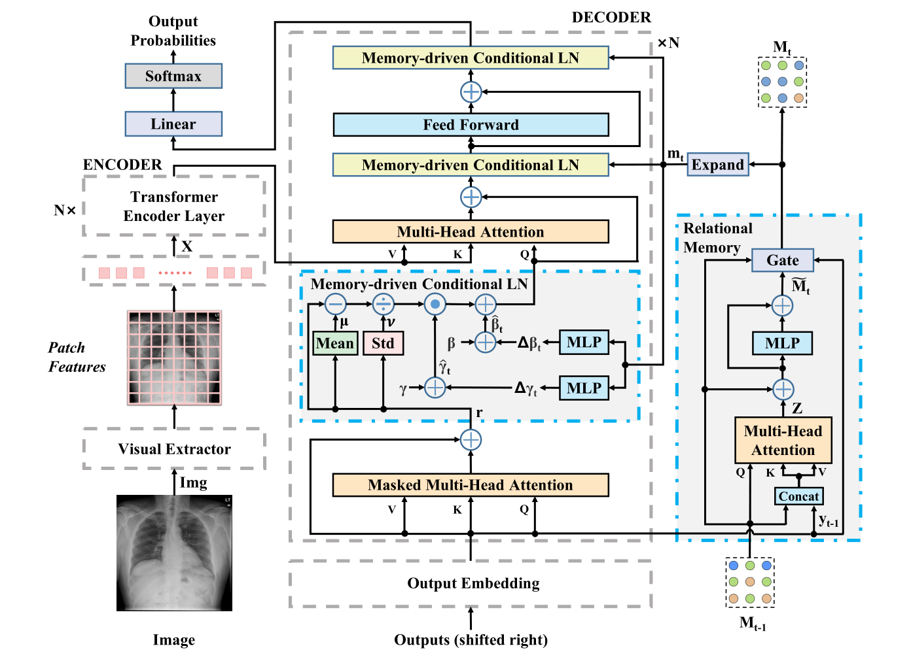

数据集：IU-Xray  MIMIC-CXR

编码器：CNN resnet152+Transformer 3

解码器：记忆驱动 Transformer 3，其实创建m

额外组建：记忆矩阵

训练方法：CE 

评价指标：NLG CE

##15.Hierarchical X-Ray Report Generation via Pathology tags and Multi Head Attention 2020年

医学图像字幕需要高精度探测异常和提取信息和连贯性。即报告必须易于阅读和传达医学事实准确。我给定一组病人的胸部x光图像,提出网络预测医学标记和报告生成一个可读的放射学。生成报告和标签,提出了网络学习来提取图像的特征从一个深CNN和生成标签为每个病人的x射线图像嵌入的。我们使用变压器学习自我和交叉的注意。我们与self-attention编码图像和标记功能得到更好的表示。同时使用上述功能交叉的关注与输入序列生成报告的结果。然后,生成之间的交叉应用的关注结果和输入序列生成报告的印象。

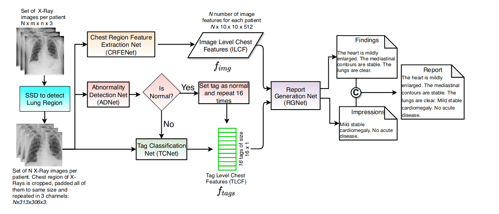

1.采用分治方法。首先，从正常患者中识别出异常患者，并生成其MTI标签嵌入。然后根据标签进行条件学习。2.为了预测报告使用一种包含两个编码器和两个解码器的Transformer。3.标签嵌入和图像特征分别使用两个编码器编码。报告的findings和impressions通过两个堆叠的解码器学习，帮助前者改进后的生成。

数据集：IU-Xray  

编码器：先SSD提取区域，提出一个简单的深度可分离卷积提取获得图像特征；

异常选择网络判断正异常产生tags

解码器：Transformer 

额外组建：

训练方法：CE 

评价指标：NLG 

##15.Automated radiology report generation using conditioned transformers 2021年

（1）微调预训练的 Chexnet 以预测图像中的特定标签。 (2) 根据预测标签的预训练嵌入计算加权语义特征。 (3) 根据视觉和语义特征调整预训练的 GPT2 模型，以生成完整的医疗报告。我们使用单词重叠指标分析生成的报告，同时添加新的有意义的基于语义的相似性指标。所提出的模型（我们称之为 CDGPT2）在定量指标方面超越了大多数非分层循环模型和基于 Transformer 的模型，同时训练速度也相当快。此外，该模型不需要特定的词汇表，并且可以在不改变架构的情况下在不同的数据集上进行训练。

数据集：IU-Xray  CheXpert

编码器：CNN Densenet121

解码器：预训练的 distilGPT2 

额外组建：

训练方法：CE 

评价指标：NLG  similarity metrics.

##16.Cross-modal Memory Networks for Radiology Report Generation2021年

提出了一种跨模式记忆网络（CMN）来增强用于放射报告生成的编码器框架，其中共享记忆用于记录图像和文本之间的对齐，以便于跨模式（即图像和文本）的交互和生成。

数据集：IU-Xray  MIMIC-CXR

编码器：CNN ResNet101+Transformer 3

解码器：Transformer 3

额外组建：跨模态记忆矩阵

训练方法：CE 

评价指标：NLG CE

##17.RATCHET: Medical Transformer for Chest X-ray Diagnosis and Reporting 2021年

数据集：IU-Xray  MIMIC-CXR

编码器：CNN Densenet121

解码器：Transformer 

额外组建：

训练方法：CE 

评价指标：NLG CE

##18.Radiology Report Generation for Rare Diseases via Few-shot Transformer 2021年

图像中疾病区域的比例较低，使得视觉信息变得多余或与要编码的罕见疾病无关。第二点在于，由于多模态表示，在编码阶段建模的相关性可能无法在解码阶段有效地解码。为了解决，提出了针对罕见疾病的小样本 Transformer 模型，即 TransGen。它组装了两个关键模块。编码阶段，引入语义感知视觉学习（SVL）模块来捕获罕见疾病的区域。解码阶段，提出了记忆增强语义增强（MASE）模块来增强中间表示。利用历史生成句子中包含的语义信息，有利于涉及罕见疾病的报告生成。

数据集：IU-Xray  MIMIC-CXR

编码器：CNN + SVL ResNet101 + Transformer

解码器：MASE+Transformer 

额外组建：SVL；记忆增强语义增强，从历史中挖掘语义信息融合到解码

训练方法：CE 

评价指标：NLG KA CE

##19.Competence-based Multimodal Curriculum Learning for Medical Report Generation 2021年

1）严重的数据偏差和2）有限的医学数据。为了减轻数据偏差并充分利用可用数据，我们提出了基于能力的多模式课程学习框架（CMCL）。具体来说，CMCL模拟放射科医生的学习过程，逐步优化模型。

使用课程学习的方式构建不同组，逐步学习。CMCL 以选择性的方式构建训练批次。 CMCL首先根据难度指标对所有训练实例进行排序，然后逐渐扩大该批次选择的训练实例的范围。通过这种方式，CMCL 可以从简单到困难的实例训练模型。

定义了学习难易程度的指标：4个

数据集：IU-Xray  MIMIC-CXR

编码器：X

解码器：X

额外组建：X

训练方法：课程学习 + CE 

评价指标：NLG 

##20.Exploring and Distilling Posterior and Prior Knowledge for Radiology Report Generation 2021年

1. 数据集中正常图像是多数，而异常是少数，其次，正常图像的外观大大优于异常图像，会分散模型的注意力，使其无法准确捕捉罕见且多样的异常区域特征。
2. 在报告中，放射科医生倾向于描述图像中的所有项目，使正常区域的描述占据整个报告的主导地位。此外，许多相似的句子被用来描述相同的正常区域。由于这种不平衡的文本分布，使用此类数据集进行训练使正常句子的生成占主导地位使模型无法描述特定的关键异常。广泛使用的HRNN生成了一些正常的重复句子，并且无法描述一些罕见但重要的异常。

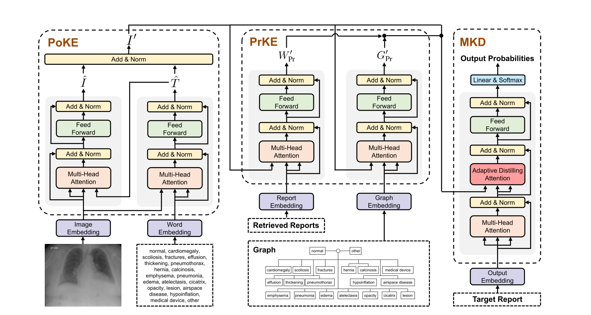

数据集：IU-Xray  MIMIC-CXR

编码器：resnet152 +Transformer

解码器：Transformer

额外组建：先验与后验知识

训练方法：CE 

评价指标：NLG  AUC

##21.Contrastive Attention for Automatic Chest X-ray Report Generation 2021年

为了有效地捕获和描述异常区域，我们提出了对比注意 (CA) 模型。 CA 模型不是只关注当前输入图像，而是将当前输入图像与正常图像进行比较以提取对比信息。获得的对比信息可以更好地表示异常区域的视觉特征。

先从数据集中提取P个正常图像，与输入图像进行Aggregate Attention，Aggregate Attention作用是排除一些噪声图像与一些视角有明显差异对图像，以防对Contrastive Attention造成负面影响。Aggregate Attention其实就是一个transformer中对点积注意力。注意这里V上全局视觉信息，所以进行完一次注意力只有1个V_closest,所以这里使用n个Aggregate Attention来生成n个V_closes。

Differentiate Attention来提取公共特征，具体做法上将V与得到的n个V_closes连接后进行自注意力计算，得到结果再全局平均池化，得到共同信息V_c。再用V-V_c得到差异信息V_d。

对比

数据集：IU-Xray  MIMIC-CXR

编码器：ResNet-50

解码器：Transformer

额外组建：

训练方法：CE 

评价指标：NLG  CE 人工评价

##22.Auto-Encoding Knowledge Graph for Unsupervised Medical Report Generation 2021年

提出一个无监督模式知识图Auto-Encoder (KGAE)接受独立的图像和报告培训。KGAE包含一个预先构建知识图,knowledgedriven编码器和知识解码器。图的知识是共享潜在空间的视觉和文本域;知识编码器项目医学图像和报告潜在的空间中相应的坐标和知识解码器生成一份医学报告给这个空间的坐标。由于知识编码器和译码器可以被训练独立的图像和报告,KGAE无监督。实验表明,无监督KGAE生成理想的医学报告不使用任何image-report训练对。

无监督

数据集：IU-Xray  MIMIC-CXR

编码器：图像ResNet-50 报告 Transformer +图神经网络

解码器：Transformer +图神经网络

额外组建：无监督指的是将图像和报告编码不成对看待。训练只通过报告编码生成报告训练解码器。还额外进行疾病分类训练减小图像与报告的差距来训练编码器。

训练方法：CE 

评价指标：NLG  CE 人工评价

##23.Progressive Transformer-Based Generation of Radiology Reports

提出了一个连续（即图像到文本到文本）生成框架，其中我们将放射报告生成问题分为两个步骤。与立即从图像生成完整的放射学报告相反，该模型在第一步从图像生成全局概念，然后使用transformer架构将其转换为更精细和连贯的文本。

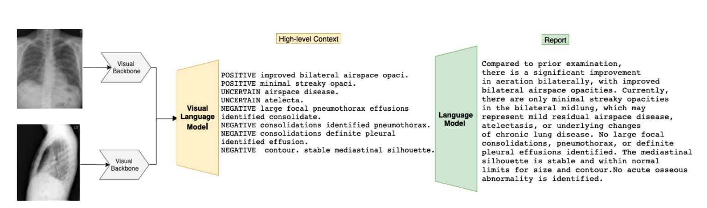

数据集：IU-Xray  MIMIC-CXR

编码器：Densenet

解码器：MeshedMemory Transformer

第二阶段：BART

额外组建：为训练数据集中的每个报告提取高级上下文C，为此，我们采用了MIRQI工具。然后，我们为每个阶段构建独立的训练数据，即ViLM和LM的微调。

训练方法：CE 

评价指标：NLG  CE 

##24.Variational Topic Inference for Chest X-Ray Report Generation 2021年

提出了用于自动生成报告的变分主题推理。具体来说，我们引入了一组主题作为潜在变量，通过在潜在空间中对齐图像和语言模式来指导句子生成。主题在条件变分推理框架中推断，每个主题都控制报告中句子的生成。

数据集：IU-Xray  MIMIC-CXR

编码器：图像Densenet + Transformer   报告Transformer

解码器：LSTM

额外组建：通过VAE拉近两个编码的距离产生报告。 +视觉注意力

训练方法：CE 

评价指标：NLG  CE 

##25.Automated Generation of Accurate & Fluent Medical X-ray Reports

全可微和端到端范式实现生成的医疗报告流畅，临床准确。该范式包含三个互补模块：以患者的胸部X光图像和临床病史文档为输入，我们的分类模块生成了疾病相关主题的内部检查表，称为丰富的疾病嵌入；然后将嵌入表示传递给基于transformer的生成器，以生成医疗报告；同时，我们的生成器还创建了加权嵌入表示，并将其提供给我们的解释器，以确保与疾病相关主题的一致性。

解释器模块是一个完全可微的网络模块，根据生成器的输出来估计疾病相关主题的清单，并与分类模块的原始输出进行比较，从而形成反馈环路增强生成的报告和分类器输出的一致性。

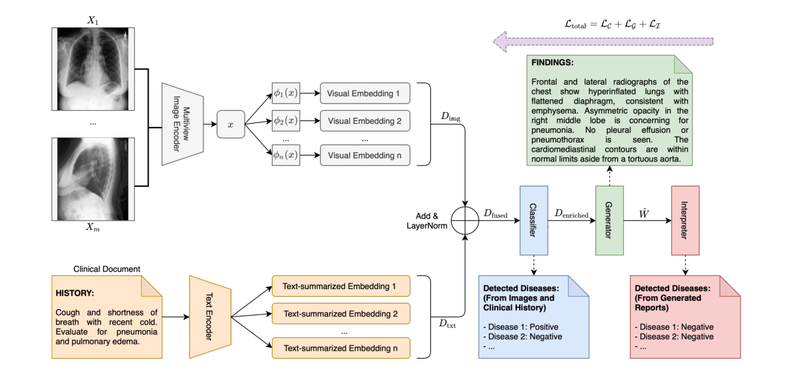

编码器：图像Densenet + Transformer   报告Transformer

解码器：Transformer

额外组建：构建来114个标签进行额外分类监督；利用来历史报告信息；可微的解释器优化

训练方法：CE 

评价指标：NLG  CE 

##26.Improving Factual Completeness and Consistency of Image-to-Text Radiology Report Generation

现有的报告生成系统尽管在自然语言生成指标（如CIDEr或BLEU）上取得了较高的性能，但仍然存在生成不完整和不一致的问题。提出了两种简单的image-to-text放射报告生成奖励，其重点是捕获生成报告的事实完整性和一致性，以及一种基于弱监督的方法，用于训练放射领域NLI模型

基础架构就是M2T的模型，这里重点是如何利用RL将两种奖励应用的。

factENT 捕捉事实的完整性。该奖励假设编码器编码了与事实完整性相关的疾病和解剖学知识。

factENTNLI F-score风格的奖励，该奖励使用非线性学习扩展事实，以捕捉事实的一致性

##27.MedSkip: Medical Report Generation Using Skip Connections and Integrated Attention

提出新颖的视觉提取器MEDSKIP，将skip连接和卷积块注意模块与HRNet结合起来，并结合Memory+Transformer来生成医疗报告。

修改HRNet包括添加跳过连接以及卷积块关注模块(CBAM)。整个体系结构可分为两个部分,第一个是预处理图像的视觉器送入HRNet卷积层。每个down-sampled输出层连接通过关注模块。

编码器：HRNet

解码器：Transformer

额外组建：

训练方法：CE 

评价指标：NLG

##29.A Self-boosting Framework for Automated Radiographic Report Generation

self-boosting框架,提高影像学报告生成基于合作报告生成的主要任务和一个辅助的任务的图像文字匹配。这两个任务是建立的两个分支网络模型和合作的方式相互影响。一方面,帮助学习高度imagetext匹配分支text-correlated视觉特性的报告生成分支输出高质量的报告。另一方面,改进报道产生的报告生成分支提供额外的困难样本图像文字匹配分支和执行后者提高自己通过学习更好的视觉和文本特征表示。反过来,这有助于提高报告生成分支了。这两个分支相互共同训练,以帮助改善迭代。

数据集：IU-Xray  MIMIC-CXR

编码器：图像：搜索性算法提取区域，renet101-Transformer

​				报告：sentence bert

解码器：分层LSTM

额外组建：生成的报告与真实报告进行

训练方法：CE +CIDER强化学习

评价指标：NLG  

##30.Weakly Supervised Contrastive Learning for Chest X-Ray Report Generation

为解决交叉熵损失函数导致的文本生成输出中出现高频标记或句子过于频繁，在交叉熵之外引入对比学习损失，提升报告生成的多样性。

GroundTruth报告用ChexBERT生成标签，标签通过聚类划分为簇，用于对比损失。给与类似的报告更多的惩罚从而鼓励多样性。

模型使用来G2en,使用来聚类作为若监督的对比学习的标签

数据集：MIMIC-ABN MIMIC-CXR

额外组建：聚类若监督’

评价指标：NLG

##31.Writing by Memorizing: Hierarchical Retrieval-based Medical Report Generation 2021年

MedWriter包含分层检索机制自动提取报告,为临床准确报告生成sentence level模板。MedWriter首先使用视觉语言检索(VLR)”模块为给定的图像检索最相关的报告。保证句子之间的逻辑一致性,介绍了语言检索(LLR)模块来检索相关的句子生成基于前面的描述。最后,译码器融合图像特征和语言特征从检索报告和句子生成有意义的医学报告。

1.先进行匹配任务预训练 ITM任务以及疾病分类任务来预训练VLR；还有句子匹配任务训练LLR，即同个报告的不同句子进行匹配

2.VLR模型依据匹配选择K个报告作为模板表述，并提取对应的关键词通过注意力选择句子生成第一个句子。LLR将检索的报告中的句子作为检索池，检索K个模板句子，再与视觉特征后前面的模板报告进行解码生成后续句子

数据集：IU-Xray  MIMIC-CXR

编码器：图像：CNN  

​				报告：bert

解码器：分层lstm

额外组建：注意力查找模板表示

训练方法：CE

评价指标：NLG  AUC 人工

##32.Radiology Report Generation with General and Specific Knowledge 2022年

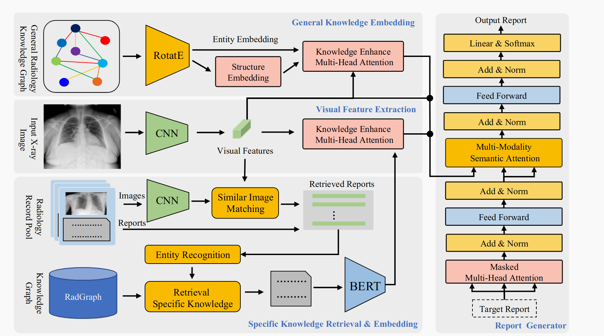

数据集：IU-Xray  MIMIC-CXR

编码器：图像：CNN  Transformer

​				报告：图神经网络

解码器：Transformer

额外组建：一般知识和特定知识 利用了RadGraph

训练方法：CE

评价指标：NLG   CE

##33 Joint Embedding of Deep Visual and Semantic Features for Medical Image Report Generation 2021

在编码阶段通过三分支网络（TriNet）对深度视觉和语义嵌入进行编码。视觉注意力分支利用软注意力机制从医学图像中捕获受关注的视觉嵌入。医疗报告（MeRP）嵌入分支预测语义报告嵌入。医学主题词（MeSH）的嵌入分支获取相关医学标签的语义嵌入作为补充信息。然后，这些分支的输出被融合并输入解码器以生成报告。

数据集：IU-Xray  MIMIC-CXR

编码器：图像：CNN  + LSTM 的每个时间步采用注意力机制来关注不同视觉内容

​				报告：尝试利用 MeRP 语料库中的语义信息来协助报告生成。TF-IDF

​				MeSH记录了医学图像最重要的标签，利用相关 MeSH 语料库中的语义信息作为补充语义特征。

解码器：LSTM

额外组建：TF-IDF MeSH

训练方法：CE

评价指标：NLG   CE

##34.Visual-Textual Attentive Semantic Consistency for Medical Report Generation2021年

提取多模态特征并与来自句子解码器的隐藏状态一起进行编码，以编码丰富的上下文向量，以便更好地解码报告。这些模式包括扫描的区域视觉特征、高概率预测的前 K 个结果的语义词嵌入以及适应症的临床特征。其次，渐进式报告解码器由句子解码器和单词解码器组成，其中我们提出图像-句子匹配和描述准确性损失来约束视觉-文本语义一致性。

除了预测疾病类别之外，我们还引入了另一种类型的标签，称为描述模式，它包含更丰富的信息，例如病变位置、大小和形状。这种设计背后的动机是疾病和描述模式标签的组合可以丰富生成报告的细节和准确性。

我们提出了一种称为归一化关键术语距离（nKTD）的新指标。目的是判断生成的句子是否包含所有观察到的疾病及其详细描述信息。

数据集：IU-Xray  MIMIC-CXR

编码器：图像：CNN DenseNet-201  + 自注意力 进行分类

​				报告中区域年龄性别等额外信息

解码器：分层LSTM

额外组建：针对句子解码的句子输出构建来描述准确率（多标签分类）和图像句子匹配两个辅助任务

训练方法：CE

评价指标：NLG   CE nKTD

## 35.Improving Radiology Report Generation via Object Dropout Strategy and MLP-based Captioner 2022年

医学图像中较强的噪声通常会干扰诊断过程，忽略了效率也是该任务的重要指标，我们引入了一种新的医学报告生成方法，称为注意引导对象退出MLP(ODM)模型。简而言之，ODM首先包含一个定制的预训练模型，以预先对齐医疗区域和相应的语言报告，以捕获与文本相关的图像特征。然后，提出了一种基于注意矩阵的细粒度丢弃策略，通过丢弃与内容无关的信息来缓解训练压力。

依据Show Attend and Tell论文进行一个模型预训练。得到图像的注意力矩阵

数据集：IU-Xray  MIMIC-CXR ROCO

编码器：图像：CNNresnet101  + 注意力矩阵+dropout（丢弃注意力低的区域）+gMLP

解码器：Transformer

额外组建：

训练方法：CE

评价指标：NLG   

## 36.Improving the Factual Correctness of Radiology Report Generation with Semantic Rewards 2022年

以前普通的NLG指标上实现高性能的系统并不总是事实上完整或一致的。通过使用新的方法可以大大改进系统:1)生成与参考一致的领域实体;2)以推理一致的方式描述这些实体。我们提出了一种新的方法，RadGraph奖励，以进一步提高生成的放射学报告的事实完整性和正确性。

使用RadGraph注释方案和模型，我们设计了F-score风格的奖励，以衡量生成的放射学报告与参考报告的一致性和完整性。

通过强化学习中奖励指标的改进来提高模型事实上的一致性和完整性。

##37.Improving Radiology Summarization with Radiograph and Anatomy Prompts 2023年

finding中的每句话通常只关注单个解剖结构，所以只需要匹配到对应的解剖区域，而不是整个图像，这有利于文本和视觉特征的对齐。因此，我们提出了一种新的解剖学增强的多模态模型来促进印象的产生。

数据集：IU-Xray  MIMIC-CXR 

编码器：图像：CNN resnet  + Transformer

解码器：Transformer

额外组建：依据某种规则提取解剖学信息或正常信息得到关键提示并编码；

 1）对齐：通过关键词与图像编码使用对比学习进行对齐；2）融合，将关键词信息与图像信息经过并行的两个注意力融合（qkv的互换，这在多篇文章中有体现）

训练方法：CE

评价指标：NLG  CE

## 37.Few-Shot Radiology Report Generation via Knowledge Transfer and Multi-modal Alignment 2022年

罕见病的放射学报告生成还是问题，提出FS-Gen。FS-Gen由两个模块组成，一个模块用于编码阶段更有效地检测罕见疾病，另一个模块用于解码阶段更好地生成疾病区域的表示。具体而言，在编码阶段，提出了级联视觉增强模块，以加强疾病之间的相关性，而不会产生频率偏差问题。另一方面，在解码阶段，引入了一个协同参考对齐主题生成模块，通过对齐多模态表示来同时捕获疾病区域的位置和语义信息。

数据集：IU-Xray  MIMIC-CXR 

编码器：图像：CNN DenseNet121+疾病标签注意力增强  +图卷积增强

解码器：分层LSTM

额外组建：通过对疾病标签进行编码矩阵获得疾病共现矩阵（所有患者共享）与增强的图像信息进行图卷积，再经过卷积得到相关矩阵（特定病例矩阵特征）再进行图卷积增强得到最后加强的图像信息。这个信息还要进行多标签分类，再解码主题过程中与图像信息进行对齐与融合。

训练方法：CE

评价指标：NLG  CE

##38.TranSQ: Transformer-Based Semantic Query for Medical Report Generation

医学报告是一种高度模式化的语句集合。每个句子对应特定类型的疾病的表述。可以根据特定的图像语义特征找出对应的模式化语句描述。将报告生成建模成集预测问题。模型生成一组语义特征来匹配可能的临床问题，并通过句子检索和选择来撰写报告。

数据集：IU-Xray  MIMIC-CXR 

编码器：VIT

解码器：Transformer

额外组建：集合预测的方式 匈牙利算法进行二分匹配

训练方法：CE

评价指标：NLG  CE

##39.Cross-modal Clinical Graph Transformer for Ophthalmic Report Generation

提出眼科报告生成(ORG)的跨模态临床图转换器(CGT)，其中临床关系三元组被注入视觉特征中作为先验知识来驱动解码过程。然而，两个主要的共同知识噪声(KN)问题可能会影响模型的有效性。通用生物医学知识库无法与报告的特定背景和语言有意义地保持一致；吸收太多的知识可能会使视觉特征偏离其正确的含义

域内训练报告中获取临床实体和关系。给定一组眼科图像，CGT首先从临床图中恢复一个子图，并将恢复的三元组注入视觉特征中。然后在编码过程中使用可见矩阵来限制知识的影响。

数据集：FFA-IR

编码器：预训练的I3D(目标检测)+Transformer（输入是图像信息与子图信息（恢复的三元组））

解码器：Transformer

额外组建：从眼科报告中构建临床图G，得到知识。图形构建模块，根据视觉提取器生成的视觉特征恢复子图。

训练方法：CE

评价指标：NLG  hit ROC

##40.Cyclic Generative Adversarial Networks With Congruent Image–Report Generation For

Explainable Medical Image Analysis
不同于侧重于从图像中生成医学报告，我们使用循环生成对抗网络(cycleGAN)生成一致的图像报告对;因此，生成的报告将充分解释医学图像，而报告生成的图像在视觉上有效地表征文本应该(充分)与原始图像相似。这项工作的目的是通过向人类用户指出支持诊断决策的类似案例，为诊断胸部x射线图像的模型输出生成值得信赖和忠实的解释。

##41.Reinforced Cross-modal Alignment for Radiology Report Generation

往的研究试图通过监督设置下的共同注意机制来促进这种对齐，但由于没有对这种对齐进行注释，因此缺乏有效和准确的对应。在本文中，我们提出了一种基于跨模态记忆(CMM)的强化学习(RL)方法，以更好地对齐放射学报告生成的视觉和文本特征。

## 42.Improving Radiology Report Generation Systems by Removing Hallucinated References to Non-existent Priors

模型是在真实世界患者报告的数据集上训练的，存在先验幻觉。为此，我们提出了两种方法来去除影像学报告中对既往文献的引用:(1)基于gpt -3的少镜头重写医学报告而不引用既往文献;(2)基于biobert的token分类方法，直接去除参考先验的词。

##43.Cross-modal Contrastive Attention Model for Medical Report Generation

正常的生理结构在图像中占主导地位，只有微小的异常。现有方法忽略了利用来自类似历史案例的有用信息。提出了一种新颖的跨模态对比注意 (CMCA) 模型，用于从相似案例中捕获视觉和语义信息。

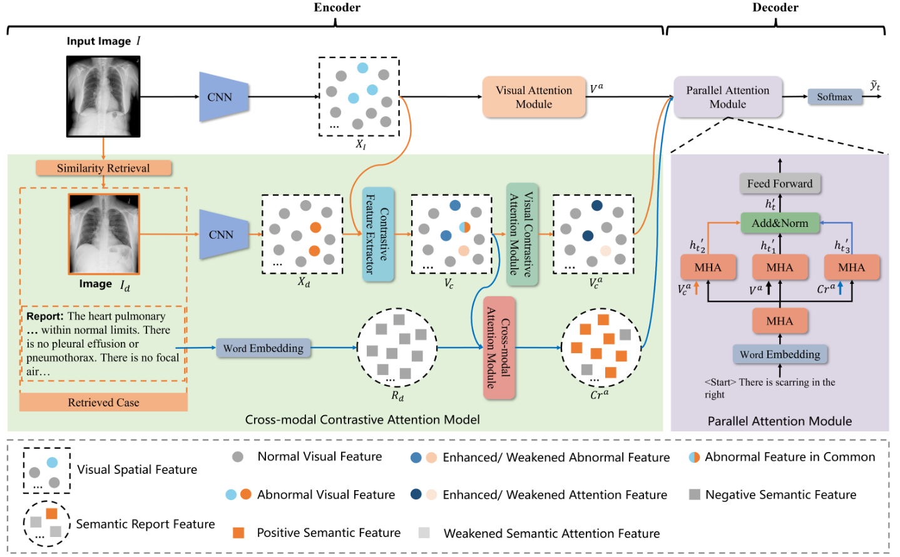

CMCA 检索输入图像的最相似案例，然后通过扩大差异并保持输入图像和检索到的图像之间的共同点来生成对比特征。对比特征用于提取视觉异常和语义匹配的信息。VCAM从对比特征中提取有区别的异常视觉信息，其中输入图像的独特异常区域被增强，相似区域被保留。 CAM 通过将检索报告中的正语义信息与对比特征对齐来匹配它，在视觉和语义模式之间建立了交互。其实就是普通的交叉注意力层。

数据集：IU X-Ray MIMIC-CXR

编码器：CNN DenseNet-121+ Transformer

解码器：Transformer并行注意模块

额外组建：使用相似案例，并且对比相减的思路。解码使用了并行注意模块。

训练方法：CE

评价指标：NLG  CE

##44.RepsNet: Combining Vision with Language for Automated Medical Reports

RepsNet由一个编码器-解码器模型组成:编码器通过对比学习将图像与自然语言描述对齐，而解码器通过对编码图像和最近邻搜索检索到的描述的先验上下文进行条件反射来预测答案。

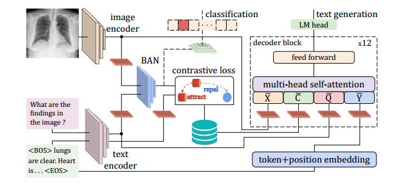

数据集：IU X-Ray

编码器：CNN ResNeXt-101

解码器：Transformer

额外组建：对比学习进行对齐 双线性池进行文本信息与图像信息融合

训练方法：CE

评价指标：NLG  

##45.Unifying Relational Sentence Generation and Retrieval for Medical Image Report Composition

目前的方法通常会生成最常见的句子，而不管这些句子是否正确地捕获了关键实体和关系。将模板检索和句子生成相结合，以处理常见和罕见异常，同时保证检测到的医学术语之间的语义一致性。具体而言，我们的方法利用混合知识协同推理:1)所有异常医学术语之间的明确关系诱导视觉注意学习和主题表示编码，以获得更好的主题导向症状描述;2)根据上下文主题编码器在模板检索和句子生成之间变化的自适应生成模式。

数据集：IU X-Ray CX-CHR

编码器：CNN 

解码器：一层lstm生成主题；主题一方面在自适应生成器中从模板数据中生成异常句子并使用单词解码器生成正常句子，将检索和生成相结合，

额外组建：CNN后进行异常分类；检索模板异常与生成正常相结合。

训练方法：CE

评价指标：NLG  AUC hit

## 46.Cross-modal Prototype Driven Network for Radiology Report Generation

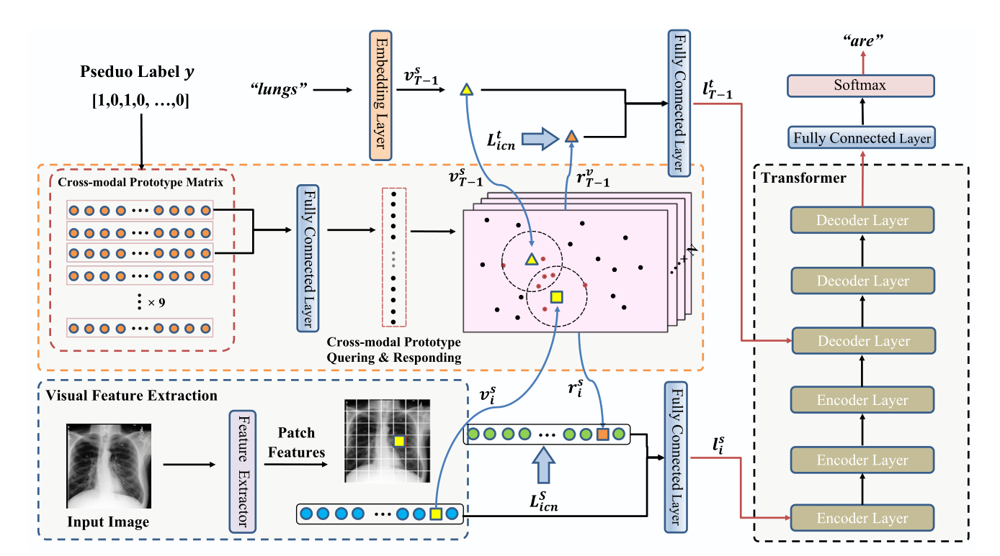

设计了一个共享的矩阵来学习跨模态，并提出了一种改进的多标签对比损失。此外，我们的查询和响应过程与类相关，也就是说，跨模态模式学习仅在共享相同标签的跨模态原型上执行，而不是在所有跨模态原型上执行。采用了一种更有效的方法将跨模态信息提取到单模态表示中，而不是R2GenCMN中使用的简单平均函数。

随机初始化矩阵不会捕获任何有意义的语义信息，并阻碍后续的原型学习。因此，利用先验信息初始化语义跨模态原型矩阵。利用预训练的视觉提取器 (imagenet-pretrained) 和 Bert (ChexBert) 来提取视觉和文本特征。结合视觉和文字特征。利用 K-mean 算法将跨模态特征聚类到 14 个聚类。

数据集：IU-Xray  MIMIC-CXR

编码器：CNN ResNet101+Transformer 3

解码器：Transformer 3

额外组建：跨模态记忆矩阵,先验初始化，对比学习方法，Prototype 分组独立学习

训练方法：CE 

评价指标：NLG CE

## 47.An Inclusive Task-Aware Framework for Radiology Report Generation

框架包括一个将图像级报告转化为结构级描述的任务蒸馏模块，一个用于生成特定结构描述的任务感知报告生成模块，以及一个用于识别和强调每个结构异常的分类令牌。自动平衡掩码丢失，缓解了正常/异常描述之间严重的数据不平衡，以及不同结构之间的不平衡。

数据集：IU-Xray  MIMIC-CXR

编码器：CNN ResNet101+Transformer 

解码器：多头Transformer 

额外组建：使用一个TD模块将报告中的描述分组。每个解码头部只负责生成特定解剖结构的描述。异常分类作为辅助任务。自动平衡掩膜损失，在训练过程中丢弃一个区域的正常样本

训练方法：CE 

评价指标：NLG CE

## 48.Prior Knowledge Enhances Radiology Report Generation

深度学习方法往往忽视了医学发现之间的相互影响，这可能是限制生成报告质量的瓶颈。在信息丰富的知识图中挖掘和表示医学发现之间的关联，并将此先验知识与放射报告生成相结合，以帮助提高生成报告的质量。我们在图中对先验知识进行文本挖掘和建模；我们将先验知识与基于图的知识推理相结合，以增强报告生成；

数据集：IU-Xray  

编码器：CNN +图卷积

解码器：两级LSTM

额外组建：多标签分类

训练方法：CE 

评价指标：NLG AUC

## 49.A Medical Semantic-Assisted Transformer for Radiographic Report Generation

使用CNN作为视觉特征提取器很难捕获细粒度的视觉差异.提出了一个记忆增强稀疏注意块，利用双线性池来捕获输入细粒度图像特征之间的高阶交互，同时产生稀疏注意。此外，我们引入了一种新的医学概念生成网络(MCGN)来预测细粒度的语义概念

数据集：MIMIC-CXR

编码器：CNN CLIP预训练resnet+xlinear+记忆

解码器：xlinear+记忆

额外组建：多标签分类获得语义融合进解码过程

训练方法：CE +cider强化学习微调

评价指标：NLG

##50.DeltaNet:Conditional Medical Report Generation for COVID-19 Diagnosis

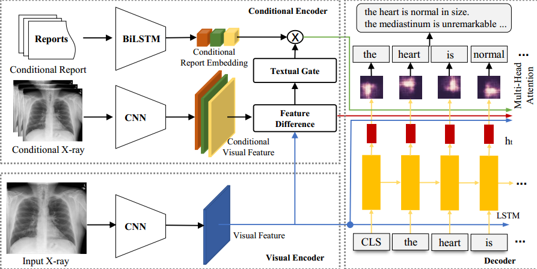

DeltaNet采用三步生成报告:1)检索相关报告，即相似患者的历史报告;2)检索到的图像与当前图像进行对比，找出差异;3)生成新报告

数据集：IU-Xray   MIMIC-CXR COVID-19 dataset

编码器：CNN  ResNet-152

解码器：图像信息，图像-相似图像的差信息，相似报告信息 融合lstm解码

额外组建：根据图像信息余弦相似度获得相似图像及报告

训练方法：CE 

评价指标：NLG CE

##51.Hybrid Reinforced Medical Report Generation with M-Linear Attention and Repetition Penalty

方法主要存在三个缺点:(1)不全面优化;(2)低阶和单维的注意机制;(3)重复生成。在本文中，我们提出了一种混合强化医学报告生成方法与m-线性注意和重复惩罚机制(HReMRG-MR)来克服这些问题。

采用不同权重的混合奖励来弥补基于单一度量的奖励的局限性。我们还提出了一种线性复杂度的搜索算法来逼近最佳权值组合。此外，我们使用m-线性关注模块来探索高阶特征交互并实现多模态推理，而重复惩罚在模型的训练过程中对重复项进行惩罚。

数据集：IU-Xray   MIMIC-CXR 

编码器：CNN ResNet-101 +M-Att(与xlinear只有融合上的区别？)

解码器：M-Att-LSTM

额外组建：贪婪搜索的混合奖励、重复惩罚、m-线性注意力。

重复惩罚模块，限制单词导致重复三元组的概率（强化学习阶段）。

训练方法：CE 混合奖励强化学习

评价指标：NLG 

## 52.Prior Guided Transformer for Accurate Radiology Reports Generation

编码器部分，首先通过卷积神经网络和传统的变压器编码器获得一组贴片特征来表示x线照片。然后应用加性高斯模型来表示基于无监督聚类和稀疏注意的先验知识。在解码器部分，先验嵌入是通过从射线图像先验概率采样获得的。然后，视觉特征、语言嵌入和先验嵌入被我们提出的先验引导注意融合，以生成准确的放射学报告。

数据集：IU-Xray   MIMIC-CXR 

编码器：CNN ResNet+vanilla Transformer +VAE进行先验建模

解码器：Prior Guided Attention Transformer 

额外组建：视觉先验建模

训练方法：CE 

评价指标：NLG CE 

## 53.AlignTransformer: Hierarchical Alignment of Visual Regions and Disease Tags for Medical Report Generation

AHA模块首先从输入图像中预测疾病标签，然后通过分层对齐视觉区域和疾病标签来学习多粒度视觉特征。获得的基于疾病的视觉特征能够更好地表示输入图像的异常区域，可以缓解数据偏差问题；

AHA首先从输入图像中预测疾病标签，然后将这些标签与相应的视觉区域对齐。为了适应粗粒度和细粒度视觉特征，AHA引入了层次对齐模型。具体来说，首先使用疾病标签找到最相关的视觉区域，为每个疾病标签提取基于疾病的视觉特征。然后，进一步使用提取的视觉特征查找最相关的疾病标签，并过滤出每个视觉特征的不相关疾病标签。通过在不同粒度级别执行上述过程，视觉感受野在疾病标签的指导下逐渐集中在显著的异常区域。这样，我们可以获得异常区域的特征，用于缓解数据偏差；

数据集：IU-Xray   MIMIC-CXR 

编码器：CNN Transformer 

解码器：Transformer 

额外组建：双路异常聚集

训练方法：CE 

评价指标：NLG CE Hit

##54.Memory-aligned Knowledge Graph for Clinically Accurate Radiology Image Report Generation

数据驱动的神经模型难以识别图像中的多粒度异常区域和相应的异常。同一异常的不同状态可能有其特点，这些视觉模式的相关性被忽略了。此外，从异常区域识别实际异常也具有挑战性，因为复杂和罕见的异常在没有专业知识的情况下很难确定。

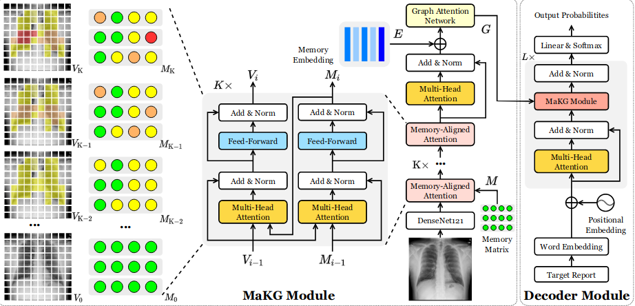

仿照以前工作，采用记忆槽记录异常区域的信息，采用图结构建模进行通用异常嵌入。Memory-aligned Graph Embedding：结构上和之前的那篇工作一致。不过输入由标签变成了一个跨模态矩阵M进行聚合异常信息。输出是将所有的层输出的中间状态最后的M进行相加再经过自注意力层进行输出得到最后的存储矩阵。再结合E通过图注意力网络GAT进行异常提取。在这里图每个节点嵌入用于预测相应异常的存在概率，分类器使用加权二元交叉熵损失进行训练。

数据集：IU-Xray   MIMIC-CXR 

编码器：CNN +双路记忆Transformer +图卷积 

解码器：Transformer 

额外组建：图结构建、双路异常聚集、记忆

训练方法：CE 

评价指标：NLG CE  Hit

##55.Attributed Abnormality Graph Embedding for Clinically Accurate X-Ray Report Generation

利用知识图方法对潜在的异常进行建模，有望提高临床准确性。本文引入了一种新的细粒度知识图结构，称为属性异常图(ATAG)。ATAG由互连的异常节点和属性节点组成，可以更好地捕获异常细节。与现有的手工构造异常图的方法不同，本文提出了一种基于注释、x射线数据集中的医学报告和RadLex放射学词典自动构造细粒度图结构的方法。然后，我们使用具有编码器-解码器架构的深度模型来学习ATAG嵌入，用于生成报告。

提出了一个新的度量放射学报告质量指数(RadRQI)来评估放射学相关异常与临床属性的准确性。

数据集：IU-Xray   MIMIC-CXR 

编码器：CNN Densenet-121+ 图增强

解码器：图增强的Transformer /图增强的LSTM

额外组建：构建知识图，以多异常和多属性分类为学习目标来学习ATAG嵌入

训练方法：CE  

评价指标：NLG CE RadRQI

##56.Radiology Report Generation with a Learned Knowledge Base and Multi-modal Alignment

我们的方法具有两个不同的模块:(i)学习知识库:为了吸收放射学报告中嵌入的知识，我们构建了一个知识库，该知识库可以自动从文本嵌入中提取和恢复医学知识，而无需人工劳动;(ii)多模态对齐:为了促进报告、疾病标签和图像之间的语义对齐，我们明确利用文本嵌入来指导视觉特征空间的学习。

数据集：IU-Xray   MIMIC-CXR 

编码器：CNN ResNet-50+ Transformer （知识增强）

解码器：Transformer 

额外组建：知识构建、图像文本对比学习对齐、标签对齐就是分类

知识更新：就是利用已知知识预测未知知识来优化

训练方法：CE  

评价指标：NLG CE

## 57.A contrastive triplet network for automatic chest X-ray reporting

严重偏差的数据分布（例如，正常情况通常比异常情况在整个数据集中占主导地位）给数据驱动的神经模型生成满意的异常描述带来了巨大挑战。提出了一种基于 Transformer 架构的对比三元组网络（CTN），用于自动胸部 X 射线报告，以缓解数据偏差问题。我们的 CTN 通过使用三元组网络比较正常和异常病例之间的视觉和语义信息，有效地增强异常。

构建了具有正例、锚例和负例（包括正常和异常情况）的不同类型的三元组。（两异常一正常或两正常一异常）然后，将从两个方面获取三元组之间的对比信息：1）将Transformer编码器编码的胸部X射线图像的视觉嵌入进行比较； 2) 将比较由预先训练的文本编码器编码的生成报告的语义嵌入。

为了实现三元组之间的语义对比，生成的锚实例报告和正负实例的真实报告被编码为语义嵌入。我们在此引入了一个预训练的文本编码器（即临床 BERT [47] 与附加的 MLP 网络相结合）用于语义嵌入。

数据集：IU-Xray   MIMIC-CXR 

编码器：CNN ResNet-50+ Transformer 

解码器：Transformer 

额外组建：三元组对比学习、反编码学习

训练方法：CE  

评价指标：NLG CE

##58.Clinically Coherent Radiology Report Generation with Imbalanced Chest X-rays

类不平衡导致一些不常见疾病的漏诊。我们提出了一种临床一致的放射学报告生成方法，引入了一个额外的记忆增强特征仿射变换(MFAT)层和一个不平衡感知的临床准确奖励(ICAR)来解决上述问题。

第一阶段包括使用标准句子生成目标进行训练的序列到序列范式，而第二阶段使生成的报告与基础真值报告更加临床一致。

数据集：IU-Xray   MIMIC-CXR 

编码器：CNN ResNet-152（在ChestX-ray8数据集上预训练）+ Transformer 

解码器：记忆增强Transformer 

额外组建：记忆增强特征仿射变换层，不平衡感知奖励（通过对CheXpert标签制作）

训练方法：CE  +不平衡感知奖励强化学习

评价指标：NLG CE

## 59. Multimodal Image-Text Matching Improves Retrieval-based Chest X-Ray Report Generation 2023年

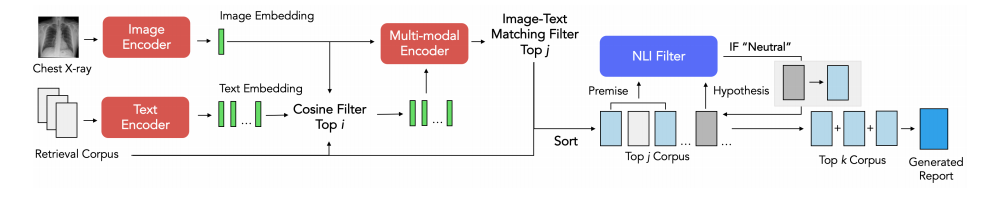

基于检索的尝试经常检索与输入图像无关的报告。在这项工作中，我们提出了对比x射线报告匹配(X-REM)，这是一种新颖的基于检索的放射学报告生成模块，它使用图像-文本匹配评分来衡量胸部x射线图像和放射学报告的相似性，以供报告检索。

X-REM选择与输入图像具有最高图像-文本匹配分数的前j个报告。X-REM按照图像-文本匹配分数递减的顺序遍历j个报告，最多选择k个报告，使用自然语言推断(NLI)分数过滤掉具有重复信息的报告。最后，模型将检索到的报告连接到由空格字符分隔的单个文档中。

数据集：MIMIC-CXR 

编码器：ALBEF （预训练）

报告：ALBEF （预训练）

解码器：记忆增强Transformer 

额外组建：使用图像报告匹配任务（二分类）正类的logit值作为配对的相似度得分。

这里正类与负类通过标签机判断而不是唯一正类

NLI Filter:候选报告与生成的报告相关或相矛盾，则该过滤器会拒绝该候选报告。当我们有矛盾或冗余时，我们优先考虑获得更高图像-文本匹配分数的报告。

训练方法：先预训练（匹配任务与MLM与对比对齐）再微调（预训练和微调步骤中图像-文本匹配损失的主要区别在于使用监督临床标签来生成负样本。）

评价指标：NLG CE RadCliQ  RadGraph F1 BERTScore 人工

## 60.Dynamic Graph Enhanced Contrastive Learning for Chest X-ray Report Generation 2023年

由于数据集偏差，这些实体无法覆盖所有数据集的最常见疾病关键词;其次，与不同器官相连的实体在临床上也会相互影响。所以提出了一种具有动态结构和节点的知识图，以促进对比学习的医疗报告生成

数据集：IU-Xray   MIMIC-CXR 

编码器：VIT

报告：动态图编码器来传播信息并学习动态图中的专用节点特征。在基础图结构上添加可能缺失的图信息；通过图像信息检索报告添加缺失信息加到图像信息中

解码器：Transformer 

额外组建：动态图；对比学习；匹配对齐

训练方法：先预训练（匹配任务与MLM与对比对齐）再微调（预训练和微调步骤中图像-文本匹配损失的主要区别在于使用监督临床标签来生成负样本。）

评价指标：NLG CE 

##61.METransformer: Radiology Report Generation by Transformer with Multiple Learnable Expert Tokens

在变压器编码器和解码器中引入多个可学习的“专家”令牌。在编码器中，每个专家令牌与视觉令牌和其他专家令牌交互，以学习参加不同的图像区域进行图像表示。鼓励这些专家令牌通过正交损失来捕获互补信息，从而最小化它们的重叠。在解码器中，每个参与的专家令牌引导输入单词和视觉令牌之间的交叉注意，从而影响生成的报告。进一步制定了基于指标的专家投票策略，以生成最终报告。

数据集：IU-Xray   MIMIC-CXR 

编码器：VIT+多专家xlinear

解码器：专家调整xlinear（在视觉输入前面加入专家调整）

额外组建：多专家

训练方法：CE+基于度量的专家投票CIDEr强化学习（每个专家的报告都可以得到一个投票分数，表示该报告与其他专家的报告的一致程度。得分最高的诊断报告是投票的获胜者。）

评价指标：NLG CE 

## 62.Visual-Linguistic Causal Intervention for Radiology Report Generation2023年

由于视觉和语言偏差引起的图像-文本数据中的虚假相关性，交叉模态混杂因素通常是不可观测的，难以明确消除。本文从视觉语言因果干预的新视角减轻了RRG的跨模态数据偏差，并提出了一种新的RRG视觉语言因果干预(VLCI)框架。

在医学预训练框架中，存在两个困难:(1)只有单一模态的未配对数据难以用于监督学习;(2)异构数据难以区分。SimVLM的训练方式预训练模型

因果前门干预隐含地去发现视觉语言混杂因素。为了缓解预训练时视觉语言数据不配对的问题，我们将PLM和MIM结合起来进行跨模态预训练提出了视觉语言因果前门干预模块VDM和LDM。

数据集：IU-Xray   MIMIC-CXR 

编码器：CNN ResNet101+ Transformer +前置

解码器：Transformer 

额外组建：因果干预

训练方法：预训练（PLM和MIM训练）

评价指标：NLG CE 

## 63.Interactive and Explainable Region-guided Radiology Report Generation2023年

从图像级特征生成完整的报告，不能明确地关注图像中的解剖区域。我们提出了一种简单而有效的区域导向报告生成模型，该模型检测解剖区域，然后描述单个显著区域以形成最终报告。

首先，目标检测器识别并提取胸部29个不同解剖区域的视觉特征。放射科医生通常在报告中只描述少数几个突出的区域(参见图1的示例报告)。区域选择模块通过二元分类器预测是否应该为每个区域生成句子来模拟这种行为。区域视觉特征也被输入到异常分类模块中，该模块由一个额外的二元分类器组成，该分类器预测一个区域是正常还是异常(即包含病理)。

数据集：IU-Xray   MIMIC-CXR 

编码器：Faster R-CNN

解码器：PubMed摘要微调的GPT-2 Medium

额外组建：目标检测器获得29个解剖区域进行区域目标生成

病理跨越多个区域可能会生成相似的句子，导致生成重复的句子。使用BERTScore来确定相似度，删除短句子，保留长句子。

训练方法：三阶段：只训练目标检测器；目标检测器与二值分类器结合；完整的模型

评价指标：NLG CE 

## 64.Token Imbalance Adaptation for Radiology Report Generation

提出了Token不平衡适配器(TIMER)，旨在提高非频繁Token的生成鲁棒性。该模型通过不可能损失自动利用令牌不平衡，并动态优化生成过程以增加不常见的令牌。

TIMER由三个主要模块组成，1)非似然损失，2)动态自适应，3)联合优化

非似然损失：将非似然损失统一起来，通过惩罚频繁标记的预测概率来减少过度拟合效应。

动态自适应：强化学习方法，允许使用动态的非似然令牌集而不是固定的令牌集。

联合优化：内外循环训练优化

## 65.Vision-knowledge fusion model for multi-domain medical report generation

现有的知识图谱实体较多，但由于难以统一提取和融合不同疾病的专家知识，使得知识图谱的语义不够充分。提出了一种基于医学图像和知识图谱的视觉知识融合模型，以充分利用来自不同疾病和不同语言的高质量数据。

知识图构建：以前构建知识图的方法通常是基于NLP的，但效果不够好。提出了一种基于医学标准的领域知识图构建方法。

提出了一种基于图的知识评价系统来评价生成的医疗报告的质量。

数据集：IU-Xray   NCRC-DS

编码器：CNN+知识注意力+Transformer

知识：图注意网络

解码器：Memory-driven Transformer

额外组建：多标签分类（预训练） 三元组恢复

我们对知识图谱中的每一类实体都执行多标签分类任务，以提高分类的准确率。

训练方法：二阶段：多标签分类训练图像编码与知识编码；报告生成训练

评价指标：NLG CE KEG指标

## 66.S4M: Generating Radiology Reports by A Single Model for Multiple Body Parts

目前的放射学报告生成模型遵循数据集或区域特定的训练和测试范例。我们试图设计一个报告生成模型，即使给出不同身体部位的不同图像，也能生成合理的报告。我们提出了一个单对多(S4M)框架，旨在促进具有两个辅助先验的报告生成模型的学习:一个显式先验(即，提供放射学知识)和一个隐式先验(即，由交叉模态特征指导)。

数据集：IU-Xray   private datasets

编码器： CNN resnet101+知识聚合（就是图像信息＋知识信息的注意力）

知识：cinical bert +知识选择

解码器：Memory-driven Transformer

额外组建：知识：构建一个涵盖放射学报告中最常见异常或发现的一般知识集。（各中报告的一些主题词）

先验指导：报告的编码与图像信息进行损失逼近

训练方法：ce

评价指标：NLG CLIPScore CE 

## 67.ORGAN: Observation-Guided Radiology Report Generation via Tree Reasoning

我们提出了一个观察引导放射学报告生成框架(ORGAN)。首先生成观测方案，然后将方案和影像同时馈送到报告生成中，其中采用观测图和树形推理机制，通过捕获每个观测的多格式，精确地丰富方案信息。

标签机获得报告提及的标签，依据提及顺序排序进行树状构造构造图。

第一阶段：普通生成结构，但生成的是规划

第二阶段：图信息经过图编码在解码器中进行融合对齐

数据集：IU-Xray  MIMIC-CXR

编码器： CNN ResNet101

解码器：Transformer+图信息融合对齐+树推理生成

训练方法：二阶段：观察规划、报告生成

评价指标：NLG  CE 

## 68.KiUT: Knowledge-injected U-Transformer for Radiology Report Generation

医学图像生成准确的报告需要多种模式的知识，包括视觉、语言和医学术语。我们提出了一种知识注入的KiUT来学习多层次的视觉表示，自适应地从上下文和临床知识中提取信息，用于单词预测。

U型结构连接编码器与解码器的每一层；

知识：视觉、上下文、临床（构建了知识图，通过图注意编码注入）

区域关系编码器探索区域之间的外在和内在关系：外在关系引入了相对位置编码；内在关系引入可学习矩阵（记忆矩阵）扩展键值。

数据集：IU-Xray  MIMIC-CXR

编码器： CNN ResNet101 + 区域关系编码器

报告：微调后的bert

解码器：Transformer

训练方法：CE

评价指标：NLG  CE 

## 69.Replace and Report: NLP Assisted Radiology Report Generation

我们提出基于模板的方法。1)使用多标签图像分类器，为输入x光片生成标签;2)使用变压器模型，从步骤(1)中生成的标签生成病理描述(x光片上看到的异常发现的描述);3)使用基于bert的多标签文本分类器，在正常报告模板中找到跨度，替换为生成的病理描述;4)使用基于规则的系统，用生成的病理描述替换已识别的跨度。

我们提出了一种通过生成病理描述，即异常发现的描述，然后用生成的病理描述替换正常报告模板中相应的正常描述来生成放射学报告的方法。

首先为异常发现创建小句子，然后将其替换为正常报告模板。

先生成Tags，再根据Tags生成报告。再根据报告生成需要替换的正常描述。替换生成最终报告。

数据集：IU-Xray  MIMIC-CXR

编码器： CNN ResNet50 

报告：微调后的bert

解码器：Transformer

训练方法：CE

评价指标：NLG  CE 

## 70.Unify, Align and Refine: Multi-Level Semantic Alignment for Radiology Report Generation

我们提出了一种统一、对齐、再细化(UAR)的方法来学习多层次的跨模态对齐，并引入了三个新的模块:潜在空间统一器(LSU)、跨模态表示对齐器(CRA)和文本图像细化器(TIR)。具体来说，LSU将多模态数据统一为离散的标记，使其能够灵活地通过共享网络学习模态之间的共同知识。模态不可知CRA首先通过一组标准正交基和双门机制学习判别特征，然后在三重对比损失下对视觉和文本表征进行全局对齐。TIR通过使用可学习的蒙版校准文本到图像的注意力来增强令牌级局部对齐。

数据集：IU-Xray  MIMIC-CXR

编码器： dVAE将图像离散化

报告：报告标记离散化

解码器：Transformer（TIR）

额外组建：图像文本的Triplet Contrastive对齐

训练方法：CE

评价指标：NLG 

## 71.Automatic Radiology Report Generation by Learning with Increasingly Hard Negatives

医学图像或报告通常彼此相似，因此自动生成放射学报告具有挑战性。这使得模型很难捕捉单个图像的唯一性，并且容易产生不希望的通用或不匹配的报告。

通过将它们与最接近的同类(即硬底片)区分开来来学习判别图像和报告特征。特别是，为了获得更多的判别特征，我们在训练过程中分别为特征空间中的每个图像创建越来越难的负面报告，从而逐渐提高了学习任务的难度。通过将越来越难的负值作为辅助变量，我们将此过程表述为最小-最大交替优化问题。

## 72.Retrieval Augmented Chest X-Ray Report Generation using OpenAI GPT models

检索增强生成(RAG)作为自动化放射学报告编写的一种方法，它利用来自对比预训练视觉语言模型的多模态对齐嵌入来检索输入放射学图像的相关候选放射学文本，并利用OpenAI文本davincii -003, gpt-3.5-turbo和gpt-4等通用领域生成模型来使用检索到的相关放射学文本生成报告。

检索的问题：纯基于检索的报告生成可能包括无发现案例报告的不相关检索，特别是当相关检索的数量K设置为> 1以生成报告时；有一些不必要的噪声，如先前的报告引用，医生姓名的提及，用户特定的详细信息等，如果它们可用，则按原样提取。纯基于检索的报告生成也会受到检索中重复内容的影响；也不可能以特定格式生成放射学报告，这可能是不同报告生成下游应用程序的要求。它可能有助于创建结构化的放射学报告，提取感兴趣的属性，如病理、位置信息、严重程度、大小等，而不是原始文本输出；纯粹的基于检索的系统在生成的报告中可能会有一些不连贯的信息，因为检索可能会带来属于两个不同患者的报告中的句子。

73 Align before Fuse: Vision and Language Representation Learning with Momentum Distillation

74 RadGraph: Extracting Clinical Entities and Relations from Radiology Reports

75 Kipf and Welling 2016

76 **[RotatE: Knowledge Graph Embedding by Relational Rotation in Complex Space](https://link.zhihu.com/?target=https%3A//openreview.net/forum%3Fid%3DHkgEQnRqYQ)**

77.Graph Attention Networks

78.The Hungarian method for the assignment problem.

79.Long short-term memory

80 Show and tell: A neural image caption generator

81Long-term recurrent convolutional networks for visual recognition and description

82  hierarchical approach for generating descriptive image paragraphs

83 Neural image caption generation with visual attention

84 Meshed-memory transformer for image captioning

85 Sequence level training with recurrent neural networks

86 Self-critical Sequence Training for Image Captionin

87. Improved image captioning via policy gradient optimization of spider

88 BERT: Pretraining of deep bidirectional transformers for language understanding

89 Preparing a collection of radiology examinations for distribution and retrieval (IU)

90 Relevance of unsupervised metrics in task-oriented dialogue for evaluating natural language generation

91Evaluating progress in automatic chest x-ray radiology report generation

92.how Artificial Intelligence Can Make Healthcare Human Again

93.Developing diagnostic radiology training in low resource countries.

94Interleaved text/image deep mining on a large-scale radiology database for automated image interpretation.

95Align, Reason and Learn: Enhancing Medical
Vision-and-Language Pre-training with Knowledge

96Knowledge-enhanced Visual-Language Pre-training on Chest Radiology Images

97Multi-Granularity Cross-modal Alignment for
Generalized Medical Visual Representation Learning

98 Multi-modal Understanding and Generation for Medical Images and Text via Vision-Language Pre-Training

99 Towards Unifying Medical Vision-and-Language
Pre-training via Soft Prompts

100.Clinical-BERT: Vision-Language Pre-training for Radiograph Diagnosis and Reports Generation

101 Producing Radiologist-Quality Reports for Interpretable Deep Learning

102-vgg

103-ResNet

104-Densenet

105-HRNet

106-vit

107-X-linear

108-ssd

109-Chest imagenome dataset for clinical reasoning

110-mimic

111-iu-xray

112-FasterR-CNN

113-Neural discrete representation learning

114-Sentence-{BERT}

115-METEOR

116-Bleu

117-Rouge

118-Cider

119-clip

120-ALIGN

121-uniter

122-simvlm

123-Visual chatgpt

124-hugginggpt

125-flamingo

126-blip-2

127-ConVIRT

128-gloria

129-medclip

130-BioVil

131-KAD

132-medklip

133-distilbert

134--deplot

135-scibert

136-padchest

137-ROCO

138-Ffa-ir

139-NegBio

140-stanford

141-gpt2

142-BART

143-TF-IDF

144-Skip-thought vectors

145 forgues2014bootstrapping

146 rus2012optimal

147-sam

1000 attention is all you need
