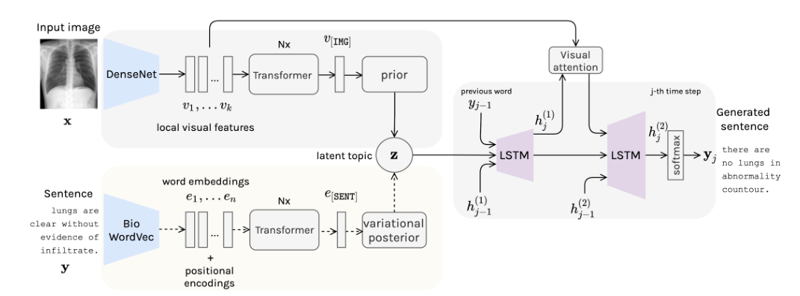
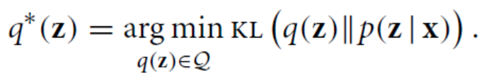

# 胸部X线报告生成的变分主题推理

Variational Topic Inference for Chest X-Ray Report Generation

论文：MICCIA2021  笔记：2022.7.19

## 问题

由于具有不同专业知识和经验的不同放射科医生编写的报告中固有的多样性和不确定性，从医学数据中学习具有挑战性。

## 提出方法

提出了用于自动生成报告的变分主题推理。具体来说，我们引入了一组主题作为潜在变量，通过在潜在空间中对齐图像和语言模式来指导句子生成。主题在条件变分推理框架中推断，每个主题都控制报告中句子的生成。

## 模型结构

### 变分主题推理（VTI）

引入了一组潜在变量，每个变量定义为控制句子生成的主题。该模型通过最大化证据下限目标（ELBO）进行优化。

我的理解就是说每个最终的报告y，都是由图像x去追求生成的y的概率分布与真实y的概率最接近。但每个报告由于医生不同，报告的说法有不确定性，所以我们单独拿出句子来预测，我们定义潜在变量z来代表句子。有x预测z，再由下xz去预测y。所以问题焦点放在了x到z。

我们把这个问题看作条件概率，在x条件下预测z的概率是p(z|x)。而z的真实概率分布是p(z). 在y的条件下预测z是p(z|y)。我们的目的是找某个概率趋近z的真实概率

在贝叶斯体系中，推断(inference)指的是利用已知变量推测未知变量的分布，即我们在已经输入$ x $后，如何获得未知变量y的$ p(y| x) $。精确推断方法准确地计算$ p(y| x) $，该过程往往需要很大的计算开销，现实应用中近似推断更为常用。近似推断的方法往往分为两大类，第一类是采样，常见的是MCMC方法，第二类是使用另一个分布近似$ p(y| x) $，典型代表就是变分推断。

变分推理的目标是近似潜在变量在观测变量下的条件概率。变分推断等价于最小化KL散度。

但由于p(z|x)未知，KL散度无法求，所以用到ELBO。

现在理解就是利用标签report送入编码训练生成一个中间状态量e[SENT],这个状态量类似bert里，单纯用来聚合report的信息的，利用ELBO使得视觉状态与e[SENT]状态最小，起到对齐效果。

e[SENT]的训练用到VAE的知识，后面补充

