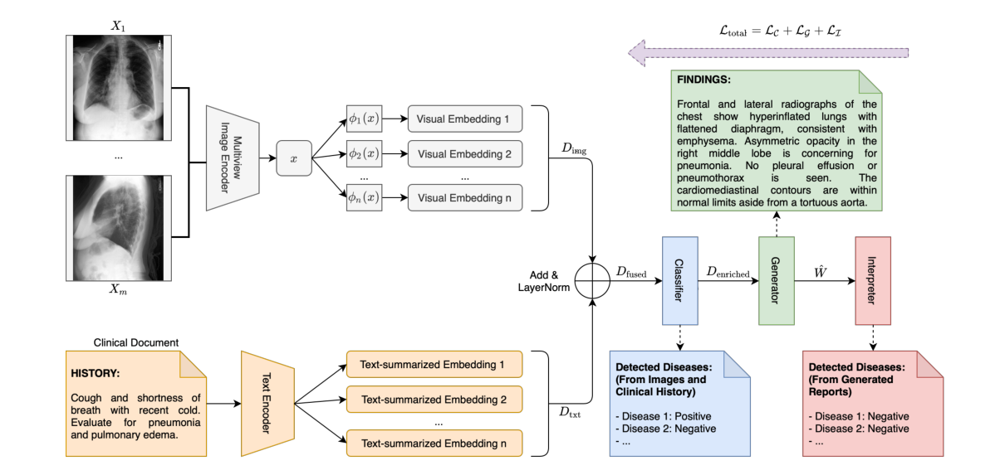
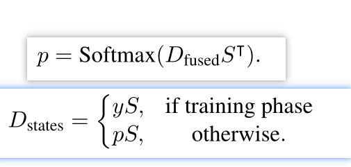
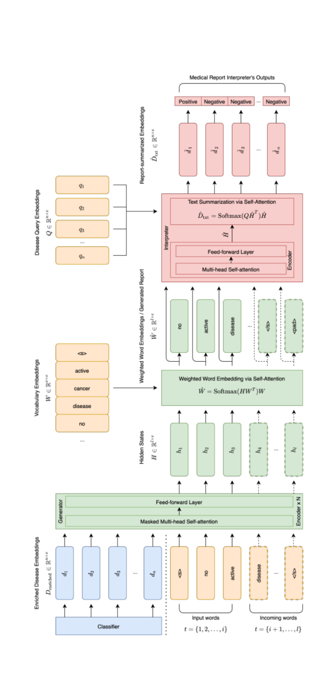

# 自动生成准确流畅的医学X射线报告

Automated Generation of Accurate & Fluent Medical X-ray Reports

论文：EMNLP 2021  笔记：2022.7.15

## 问题

现有的医疗报告生成工作强调生成人类可读的报告，但生成的文本可能与临床事实不太一致。

原因是与医学报告的文本特征密切相关，通常由许多长句组成，这些长句以精确和特定领域的术语描述各种疾病相关症状和相关主题。这清楚地将医疗报告生成任务与典型的图像到文本问题（例如基于图像的字幕）区分开来；另一个原因与缺乏充分利用编码先验知识的丰富语境信息有关。

## 提出方法

通过我们的完全可微和端到端范式实现生成的医疗报告流畅，临床准确。该范式包含三个互补模块：以患者的胸部X光图像和临床病史文档为输入，我们的分类模块生成了疾病相关主题的内部检查表，称为丰富的疾病嵌入；然后将嵌入表示传递给基于transformer的生成器，以生成医疗报告；同时，我们的生成器还创建了加权嵌入表示，并将其提供给我们的解释器，以确保与疾病相关主题的一致性。

## 模型结构

### history是什么？

report里有indication comparison findings impression四种种信息。这里说是以前的病情或者医生的指导信息。在report中是指indication comparison部分，而我们的目标是findings 的部分。

### classifier标签？

114个。14的来源就是疾病文本的提取的CheXpert标签。100是名词短语。是通过对report里findings 部分进行进行名词短语提取，取了最常见的100个。（这难道不是用到了标签信息？？？疑惑，唉）就是这样制作了114类的多分类标签。

图像通过CNN编码，history通过transformer的encode编码，编码信息经过某种融合得到D_fused.

分类步骤：他初始了一个embedding层，以及一个随机矩阵，随机矩阵state_index送入embedding层得到state_embed。其中state_index的目的是提供一个分类项，每次都随机，无意义。有意义的是embedding层的参数（embedding层就是矩阵）。得到的state_embed融合了embedding层学习的信息。D_fused与state_embed进行注意力（其实就是矩阵相乘），得到注意力机制编码结果用来做分类。将分类的结果再次进入这个embedding层得到D_state.(图中S就是embedding层)

还有一个D_topic。也是一个embedding层。论文中说这个在训练过程中学到了疾病描述。但谁知道？反正是个可学习的矩阵，不知道学到是啥，应该是数据中的通用知识。三者组成了D_enriched给生成网络。

### 生成网络

