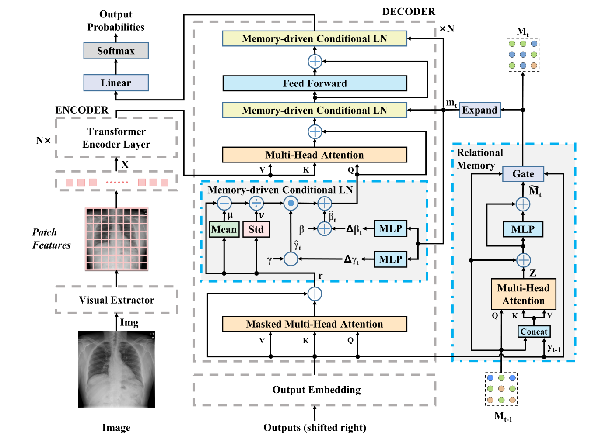

# 通过memory-driven驱动Transformer生成放射报告

Generating Radiology Reports via Memory-driven Transformer

论文：EMNLP-2020  笔记：2022.7.4

## 问题

虽然基于检索的方法可能会获得有希望的结果，但它们在准备大型数据库或显式构建模板列表以确定各种报告中嵌入的模式方面仍然有限。总之就是说之前的方法效果不好。我这个good。

## 提出方法

1. 我们提出一种memory-driven驱动Transformer模型生成放射报告。
2. 提出一种关系记忆来记住前一代生成的过程，MCLN将记忆关系合并到Transformer解码器的层中。

## 模型结构

整体结构如上，包含视觉提取器、编码器、解码器。在解码器中包含了关系记忆组件和MCLN归一化，作者基于这样一个想法，在整个训练集上存在相似的图像，即病症一样，他们在信息上有共通性，所以利用记忆组件来记忆这种共通性。

### 关系记忆组件

关系记忆使用一个矩阵M去表示随生成时间步的状态，状态M利用记忆槽slot记录一些重要的模式信息。在生成期间，矩阵被一步步更新整合利用来自前一时间步的输出。在时间步t，来自先前时间步的矩阵M_t-1作为Query，M_t-1和上一时刻的输出的嵌入y_t-1的拼接作为Key和Value传入多头注意力模块。采用多头注意模型对Q、K和V进行建模，以描述不同模式之间的关系。同时，引入残差连接和门控机制以缓解梯度消失和梯度爆炸问题。

### 记忆驱动的条件层归一化MCLN

在原始的transformer中使用LN层来进行归一化，γ和β是两个重要参数，γ用于放大学习表示中的值，β为其提供偏差调整。这里使用记忆组件生成的信息Mt来经过MLP对γ和β进行调整，注意这里网络调整的是变化量。

## 结果

作者进行了消融实验证明记忆组件和MCLN的有效性。并且与之前的算法进行了比较到达了SOTA。

